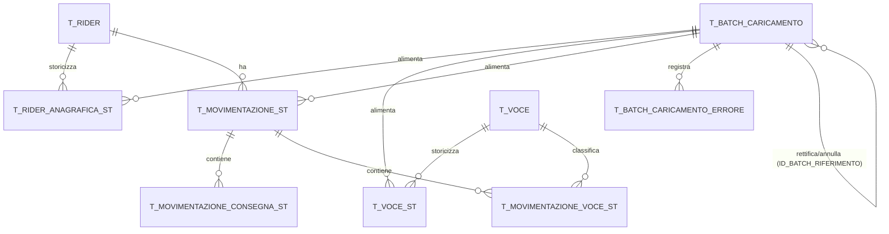

# Progettazione API di ingestione + modello dati Oracle — Dati Rider Deliveroo

## 1. Obiettivo

I file disponibili (`anagrafica.json`, `voci.csv`, `movimentazioni.json`) arrivano periodicamente da un sistema esterno e devono essere acquisiti tramite API che scrivono su Oracle. Il requisito chiave non è solo "salvare l'ultimo dato", ma **non perdere mai la storia**: per ogni informazione deve restare tracciato *quando* è arrivata (data/ora di inserimento nel DB) e *quale invio/file* l'ha portata, così che in caso di correzioni successive (es. una movimentazione ricalcolata, un cambio di regime fiscale, una nuova descrizione voce) si possa sempre ricostruire cosa si sapeva e quando.

Per questo l'intero modello è **append‑only / storicizzato (SCD Type 2)**: non si fanno `UPDATE` sui dati di business, si inserisce sempre una nuova versione con il proprio timestamp di arrivo. Le versioni precedenti restano leggibili per l'audit.

## 2. Analisi dei file di origine

| File | Contenuto | Natura del dato |
|---|---|---|
| `anagrafica.json` | Dati anagrafici e regime fiscale dei rider, con `data_inizio`/`data_fine` di validità | Master data **variabile nel tempo** (il regime fiscale o l'indirizzo possono cambiare) |
| `voci.csv` | Dizionario delle "voci" economiche (bonus, trattenute, righe di prospetto) con flag se richiedono un mese di riferimento | Master data / lookup, cambia raramente |
| `movimentazioni.json` | Prospetto paga periodico per rider: consegne giornaliere, modifiche/integrazioni, prospetto finale, riepilogo trattenute | Dato transazionale periodico, può arrivare più volte per lo stesso periodo (rettifiche) |

Dettaglio struttura di `movimentazioni.json` per record:
- header: `id_movimentazione` (chiave naturale dalla fonte), `id_rider`, `periodo_da`, `periodo_a`
- `consegne[]`: righe giornaliere (`data`, `numero_consegne`, `totale_parziale_lordo`)
- `totali_consegne`: aggregato del blocco consegne
- `modifiche_integrazioni[]`: righe voce (`id_voce`, `importo_lordo`, `ritenuta_percentuale`, `ritenuta_importo`, `iva_percentuale`, `iva_importo`, `totale`, opzionale `mese_riferimento`)
- `totali_modifiche_integrazioni`: aggregato del blocco precedente
- `prospetto_finale[]`: righe voce di riepilogo (stesso formato di `modifiche_integrazioni`, ma sezione diversa)
- `riepilogo`: `imposta_bollo`, `percentuale/importo_trattenute_fiscali`, `percentuale/importo_trattenute_previdenziali`, `pagamenti_contanti_gia_riscossi`, `totale_dovuto`

`modifiche_integrazioni` e `prospetto_finale` hanno **la stessa forma** → nel DB diventano lo stesso tipo di riga, distinta da una colonna `TIPO_SEZIONE`.

## 3. Principio di storicizzazione (comune a tutte le tabelle)

Ogni tabella "storicizzata" segue questo pattern:

- **Non si aggiorna né si cancella nulla.** Ogni nuovo arrivo per la stessa chiave di business genera una nuova riga.
- `ID_BATCH_CARICAMENTO` — riferimento a chi/quando ha portato quella riga (FK verso `T_BATCH_CARICAMENTO`).
- `DT_INSERIMENTO` — timestamp esatto di scrittura su Oracle (`SYSTIMESTAMP`), è la risposta a "quando è arrivata questa informazione".
- `FLAG_ULTIMA_VERSIONE` (`'S'`/`'N'`) — comodo per leggere velocemente lo stato corrente senza calcolare il max ad ogni query; viene aggiornato (unico caso di "update", e solo su questa colonna tecnica) quando arriva una versione più recente della stessa chiave.
- `STATO_RECORD` (`'ATTIVO'`/`'ANNULLATO'`) — distingue una versione valida da una versione che rappresenta l'**annullamento logico** di un caricamento errato (vedi § 9.3). Anche l'annullamento è "solo insert": non si torna mai alla versione precedente cancellando quella nuova, si aggiunge semmai un'ulteriore versione corretta.
- Vista `VW_*_CORRENTE` che espone solo `FLAG_ULTIMA_VERSIONE='S' AND STATO_RECORD='ATTIVO'`.

Questo dà sia la vista "stato attuale" (per i consumer applicativi) sia la vista "storico completo" (per audit/compliance), senza duplicare la logica.

## 4. Tabella di log ingestioni (batch)

Ogni chiamata API che porta dati (un file, o una singola entità via API puntuale) crea prima una riga di batch. Tutte le righe di business inserite in quella chiamata puntano al batch. La stessa tabella copre anche le operazioni di **annullamento** e **rettifica** (§ 9.3): non sono un caricamento nuovo ma vanno comunque tracciate con lo stesso meccanismo (chi, quando, perché).

```sql
CREATE TABLE T_BATCH_CARICAMENTO (
  ID_BATCH              NUMBER GENERATED ALWAYS AS IDENTITY PRIMARY KEY,
  TIPO_ENTITA           VARCHAR2(30)  NOT NULL,   -- ANAGRAFICA | VOCE | MOVIMENTAZIONE
  TIPO_OPERAZIONE       VARCHAR2(20)  NOT NULL DEFAULT 'CARICAMENTO'
                          CHECK (TIPO_OPERAZIONE IN ('CARICAMENTO','RETTIFICA','ANNULLAMENTO')),
  ID_BATCH_RIFERIMENTO  NUMBER REFERENCES T_BATCH_CARICAMENTO(ID_BATCH),
                        -- popolato solo per RETTIFICA/ANNULLAMENTO: batch originale corretto/annullato
  MOTIVO_OPERAZIONE     VARCHAR2(4000),
                        -- obbligatorio (a livello applicativo) per RETTIFICA/ANNULLAMENTO
  NOME_FILE_ORIGINE     VARCHAR2(255),
  FORMATO_FILE          VARCHAR2(10),              -- JSON | CSV
  CLIENT_ID             VARCHAR2(100),              -- sistema/utente chiamante
  DT_RICEZIONE          TIMESTAMP NOT NULL,          -- quando l'API ha ricevuto la request
  DT_INIZIO_ELABORAZIONE TIMESTAMP,
  DT_FINE_ELABORAZIONE  TIMESTAMP,
  ESITO                 VARCHAR2(10),               -- OK | KO | PARZIALE
  NUM_RECORD_TOTALI     NUMBER,
  NUM_RECORD_OK         NUMBER,
  NUM_RECORD_KO         NUMBER,
  CHECKSUM_FILE         VARCHAR2(64),               -- sha256 del payload, per individuare re-invii identici
  NOTE                  VARCHAR2(4000)
);
```

```sql
CREATE TABLE T_BATCH_CARICAMENTO_ERRORE (
  ID_BATCH_ERRORE  NUMBER GENERATED ALWAYS AS IDENTITY PRIMARY KEY,
  ID_BATCH         NUMBER NOT NULL REFERENCES T_BATCH_CARICAMENTO(ID_BATCH),
  CHIAVE_BUSINESS  VARCHAR2(200),      -- es. id_rider o id_movimentazione del record fallito
  MESSAGGIO_ERRORE VARCHAR2(4000),
  PAYLOAD_JSON     CLOB,               -- record originale, per poter fare replay/debug
  DT_INSERIMENTO   TIMESTAMP DEFAULT SYSTIMESTAMP
);
```

## 5. Master data: anagrafica rider (storicizzata, partizionata)

L'anagrafica storicizzata cresce ad ogni variazione di ogni rider (nuova versione = nuova riga), quindi su una popolazione ampia di rider e un orizzonte di anni i volumi sono paragonabili a un dato quasi-transazionale. Si partiziona quindi **fin dalla creazione** per `RANGE` su `DT_INSERIMENTO`, con `INTERVAL` mensile automatico (Oracle crea da sé le partizioni future, non serve un job di manutenzione):

```sql
CREATE TABLE T_RIDER_ANAGRAFICA_ST (
  ID_ANAGRAFICA_ST        NUMBER GENERATED ALWAYS AS IDENTITY PRIMARY KEY,
  ID_RIDER               VARCHAR2(40)  NOT NULL,   -- chiave di business dalla fonte
  REGIME_FISCALE         VARCHAR2(40)  NOT NULL,   -- PRESTAZIONE_OCCASIONALE | REGIME_FORFETTARIO | REGIME_ORDINARIO
  DATA_INIZIO_VALIDITA   DATE          NOT NULL,
  DATA_FINE_VALIDITA     DATE,
  NOME                   VARCHAR2(100) NOT NULL,
  COGNOME                VARCHAR2(100) NOT NULL,
  CODICE_FISCALE         VARCHAR2(16)  NOT NULL,
  PARTITA_IVA            VARCHAR2(11),             -- assente per PRESTAZIONE_OCCASIONALE
  TELEFONO_CELLULARE     VARCHAR2(20),
  EMAIL                  VARCHAR2(200),
  INDIRIZZO_RESIDENZA    VARCHAR2(200),
  CODICE_ISTAT_RESIDENZA VARCHAR2(10),
  COMUNE_RESIDENZA       VARCHAR2(100),
  PROVINCIA_RESIDENZA    VARCHAR2(2),
  CAP_RESIDENZA          VARCHAR2(5),
  ID_BATCH_CARICAMENTO   NUMBER NOT NULL REFERENCES T_BATCH_CARICAMENTO(ID_BATCH),
  DT_INSERIMENTO         TIMESTAMP NOT NULL DEFAULT SYSTIMESTAMP,
  FLAG_ULTIMA_VERSIONE   CHAR(1) NOT NULL DEFAULT 'S' CHECK (FLAG_ULTIMA_VERSIONE IN ('S','N')),
  STATO_RECORD           VARCHAR2(10) NOT NULL DEFAULT 'ATTIVO' CHECK (STATO_RECORD IN ('ATTIVO','ANNULLATO'))
)
PARTITION BY RANGE (DT_INSERIMENTO)
INTERVAL (NUMTOYMINTERVAL(1,'MONTH'))
(
  PARTITION P_ANAG_INIZIALE VALUES LESS THAN (TIMESTAMP '2026-01-01 00:00:00')
);

CREATE INDEX IX_RIDER_ANAG_RIDER ON T_RIDER_ANAGRAFICA_ST (ID_RIDER, FLAG_ULTIMA_VERSIONE) LOCAL;
```

L'indice è `LOCAL` (una struttura per partizione): le query più frequenti filtrano per `ID_RIDER` e non per data, quindi l'indice locale è "nonprefixed" (Oracle lo gestisce comunque in automatico), ma il vantaggio resta decisivo lato manutenzione — quando una partizione mensile viene archiviata o eliminata a fine retention, l'indice locale associato si elimina con essa senza toccare il resto della tabella (con un indice `GLOBAL` servirebbe un rebuild).

```sql
CREATE VIEW VW_RIDER_ANAGRAFICA_CORRENTE AS
SELECT * FROM T_RIDER_ANAGRAFICA_ST WHERE FLAG_ULTIMA_VERSIONE = 'S' AND STATO_RECORD = 'ATTIVO';
```

**Logica di scrittura**: alla ricezione di un nuovo `anagrafica.json`, per ogni rider:
1. se non esiste alcuna riga con quell'`ID_RIDER` → insert con `FLAG_ULTIMA_VERSIONE='S'`, `STATO_RECORD='ATTIVO'`;
2. se esiste già una versione corrente **identica** in tutti i campi → non inserire nulla (evita di "sporcare" la storia con re-invii invariati), ma si può comunque loggare il batch per tracciare che è arrivato;
3. se esiste una versione corrente **diversa** → `UPDATE T_RIDER_ANAGRAFICA_ST SET FLAG_ULTIMA_VERSIONE='N' WHERE ID_RIDER=... AND FLAG_ULTIMA_VERSIONE='S'` seguito da insert della nuova versione.

Per l'annullamento di una versione errata si veda § 9.3 — non è una casistica di questa POST, ma dell'API `DELETE` dedicata.

## 6. Master data: dizionario voci (storicizzato)

```sql
CREATE TABLE T_VOCE_ST (
  ID_VOCE_ST                    NUMBER GENERATED ALWAYS AS IDENTITY PRIMARY KEY,
  ID_VOCE                      VARCHAR2(60) NOT NULL,   -- es. INDENNITA_FESTIVI, PROSPETTO_TOTALE
  DESCRIZIONE                  VARCHAR2(400) NOT NULL,
  MESE_RIFERIMENTO_RICHIESTO   CHAR(1) NOT NULL CHECK (MESE_RIFERIMENTO_RICHIESTO IN ('S','N')),
  ID_BATCH_CARICAMENTO         NUMBER NOT NULL REFERENCES T_BATCH_CARICAMENTO(ID_BATCH),
  DT_INSERIMENTO                TIMESTAMP NOT NULL DEFAULT SYSTIMESTAMP,
  FLAG_ULTIMA_VERSIONE         CHAR(1) NOT NULL DEFAULT 'S' CHECK (FLAG_ULTIMA_VERSIONE IN ('S','N')),
  STATO_RECORD                 VARCHAR2(10) NOT NULL DEFAULT 'ATTIVO' CHECK (STATO_RECORD IN ('ATTIVO','ANNULLATO'))
);

CREATE INDEX IX_VOCE_ID ON T_VOCE_ST (ID_VOCE, FLAG_ULTIMA_VERSIONE);

CREATE VIEW VW_VOCE_CORRENTE AS
SELECT * FROM T_VOCE_ST WHERE FLAG_ULTIMA_VERSIONE = 'S' AND STATO_RECORD = 'ATTIVO';
```

Nota: `ID_VOCE` è usato come **codice** stabile (chiave logica), non enum rigido a DB, così se arrivano nuovi codici dal file CSV non serve alcuna migrazione. A differenza di anagrafica e movimentazioni, `T_VOCE_ST` **non viene partizionata**: è un dizionario con poche decine di codici che cambia raramente, non rientra nei volumi "notevoli" per cui vale la pena introdurre la complessità del partizionamento.

## 7. Dati transazionali: movimentazioni (storicizzate, partizionate)

Il record che arriva ha una chiave naturale `id_movimentazione`. Se lo stesso `id_movimentazione` arriva di nuovo (rettifica), si crea un nuovo header con tutti i suoi dettagli: **niente viene aggiornato in-place**, l'intero record precedente resta consultabile. Questa è la tabella con il volume più alto in assoluto (una riga per ogni invio/rettifica di ogni rider per ogni periodo), quindi si partiziona per `RANGE` su `DT_INSERIMENTO` con `INTERVAL` mensile fin dalla creazione, esattamente come l'anagrafica.

Prima l'anagrafica dei riferimenti leggeri (necessaria per avere FK reali, vedi nota sotto), poi l'header:

```sql
CREATE TABLE T_RIDER (
  ID_RIDER   VARCHAR2(40) PRIMARY KEY,
  DT_PRIMA_COMPARSA TIMESTAMP NOT NULL DEFAULT SYSTIMESTAMP
);

CREATE TABLE T_VOCE (
  ID_VOCE    VARCHAR2(60) PRIMARY KEY,
  DT_PRIMA_COMPARSA TIMESTAMP NOT NULL DEFAULT SYSTIMESTAMP
);
```

> **Nota sulle FK verso master data storicizzato**: `T_RIDER_ANAGRAFICA_ST` non ha `ID_RIDER` come chiave univoca (ne ha più versioni), quindi non può essere referenziata direttamente con una FK classica. Per questo si usano tabelle "master" leggere (`T_RIDER`, `T_VOCE`, solo la chiave di business come vera PK, popolate una volta al primo avvistamento) come target delle FK reali, mantenendo `T_RIDER_ANAGRAFICA_ST`/`T_VOCE_ST` solo per gli attributi storicizzati.

```sql
CREATE TABLE T_MOVIMENTAZIONE_ST (
  ID_MOVIMENTAZIONE_ST              NUMBER GENERATED ALWAYS AS IDENTITY PRIMARY KEY,
  ID_MOVIMENTAZIONE                VARCHAR2(100) NOT NULL,  -- chiave di business dalla fonte
  ID_RIDER                         VARCHAR2(40)  NOT NULL,
  PERIODO_DA                       DATE NOT NULL,
  PERIODO_A                        DATE NOT NULL,

  -- totali_consegne
  TOT_NUMERO_CONSEGNE              NUMBER,
  TOT_CONSEGNE_LORDO               NUMBER(12,2),

  -- totali_modifiche_integrazioni
  TOT_MODIFICHE_IMPORTO_LORDO      NUMBER(12,2),
  TOT_MODIFICHE_RITENUTA_PERC      NUMBER(5,2),
  TOT_MODIFICHE_RITENUTA_IMPORTO   NUMBER(12,2),
  TOT_MODIFICHE_IVA_PERC           NUMBER(5,2),
  TOT_MODIFICHE_IVA_IMPORTO        NUMBER(12,2),
  TOT_MODIFICHE_TOTALE             NUMBER(12,2),

  -- riepilogo
  IMPOSTA_BOLLO                    NUMBER(12,2),
  PERC_TRATTENUTE_FISCALI          NUMBER(5,2),
  IMPORTO_TRATTENUTE_FISCALI       NUMBER(12,2),
  PERC_TRATTENUTE_PREVIDENZIALI    NUMBER(5,2),
  IMPORTO_TRATTENUTE_PREVIDENZIALI NUMBER(12,2),
  PAGAMENTI_CONTANTI_GIA_RISCOSSI  NUMBER(12,2),
  TOTALE_DOVUTO                    NUMBER(12,2),

  ID_BATCH_CARICAMENTO              NUMBER NOT NULL REFERENCES T_BATCH_CARICAMENTO(ID_BATCH),
  DT_INSERIMENTO                    TIMESTAMP NOT NULL DEFAULT SYSTIMESTAMP,
  FLAG_ULTIMA_VERSIONE              CHAR(1) NOT NULL DEFAULT 'S' CHECK (FLAG_ULTIMA_VERSIONE IN ('S','N')),
  STATO_RECORD                      VARCHAR2(10) NOT NULL DEFAULT 'ATTIVO' CHECK (STATO_RECORD IN ('ATTIVO','ANNULLATO')),

  CONSTRAINT FK_MOV_RIDER FOREIGN KEY (ID_RIDER) REFERENCES T_RIDER(ID_RIDER)
)
PARTITION BY RANGE (DT_INSERIMENTO)
INTERVAL (NUMTOYMINTERVAL(1,'MONTH'))
(
  PARTITION P_MOV_INIZIALE VALUES LESS THAN (TIMESTAMP '2026-01-01 00:00:00')
);

CREATE INDEX IX_MOV_ID_MOVIMENTAZIONE ON T_MOVIMENTAZIONE_ST (ID_MOVIMENTAZIONE, FLAG_ULTIMA_VERSIONE) LOCAL;
CREATE INDEX IX_MOV_RIDER_PERIODO ON T_MOVIMENTAZIONE_ST (ID_RIDER, PERIODO_DA, PERIODO_A) LOCAL;
```

### 7.1 Dettaglio consegne giornaliere

Legato alla **specifica versione** dell'header (`ID_MOVIMENTAZIONE_ST`), non alla chiave di business: quando arriva una nuova versione, si inserisce un nuovo set completo di righe collegate al nuovo header. Essendo 1:N stretto con l'header, si usa `PARTITION BY REFERENCE`: la tabella figlia eredita automaticamente lo schema di partizionamento del padre (comprese le nuove partizioni mensili create dall'`INTERVAL`), senza bisogno di una propria colonna `DT_INSERIMENTO` né di logica aggiuntiva.

```sql
CREATE TABLE T_MOVIMENTAZIONE_CONSEGNA_ST (
  ID_CONSEGNA_ST          NUMBER GENERATED ALWAYS AS IDENTITY PRIMARY KEY,
  ID_MOVIMENTAZIONE_ST    NUMBER NOT NULL,
  DATA_CONSEGNA          DATE NOT NULL,
  NUMERO_CONSEGNE        NUMBER NOT NULL,
  TOTALE_PARZIALE_LORDO  NUMBER(12,2) NOT NULL,
  CONSTRAINT FK_CONSEGNA_MOV FOREIGN KEY (ID_MOVIMENTAZIONE_ST)
    REFERENCES T_MOVIMENTAZIONE_ST(ID_MOVIMENTAZIONE_ST)
)
PARTITION BY REFERENCE (FK_CONSEGNA_MOV);

CREATE INDEX IX_CONSEGNA_MOV ON T_MOVIMENTAZIONE_CONSEGNA_ST (ID_MOVIMENTAZIONE_ST, DATA_CONSEGNA) LOCAL;
```

### 7.2 Dettaglio voci (modifiche/integrazioni + prospetto finale)

Stessa forma per entrambe le sezioni, distinte da `TIPO_SEZIONE`; stessa logica di partizionamento per riferimento della tabella precedente.

```sql
CREATE TABLE T_MOVIMENTAZIONE_VOCE_ST (
  ID_MOV_VOCE_ST          NUMBER GENERATED ALWAYS AS IDENTITY PRIMARY KEY,
  ID_MOVIMENTAZIONE_ST    NUMBER NOT NULL,
  TIPO_SEZIONE           VARCHAR2(30) NOT NULL CHECK (TIPO_SEZIONE IN ('MODIFICA_INTEGRAZIONE','PROSPETTO_FINALE')),
  ID_VOCE                VARCHAR2(60) NOT NULL REFERENCES T_VOCE(ID_VOCE),
  MESE_RIFERIMENTO       VARCHAR2(7),               -- formato 'YYYY-MM', solo se la voce lo richiede
  IMPORTO_LORDO          NUMBER(12,2),
  RITENUTA_PERCENTUALE   NUMBER(5,2),
  RITENUTA_IMPORTO       NUMBER(12,2),
  IVA_PERCENTUALE        NUMBER(5,2),
  IVA_IMPORTO            NUMBER(12,2),
  TOTALE                 NUMBER(12,2),
  CONSTRAINT FK_MOVVOCE_MOV FOREIGN KEY (ID_MOVIMENTAZIONE_ST)
    REFERENCES T_MOVIMENTAZIONE_ST(ID_MOVIMENTAZIONE_ST)
)
PARTITION BY REFERENCE (FK_MOVVOCE_MOV);

CREATE INDEX IX_MOVVOCE_MOV ON T_MOVIMENTAZIONE_VOCE_ST (ID_MOVIMENTAZIONE_ST, TIPO_SEZIONE) LOCAL;
CREATE INDEX IX_MOVVOCE_VOCE ON T_MOVIMENTAZIONE_VOCE_ST (ID_VOCE) LOCAL;
```

### 7.3 Vista "stato corrente" per i consumer applicativi

```sql
CREATE VIEW VW_MOVIMENTAZIONE_CORRENTE AS
SELECT * FROM T_MOVIMENTAZIONE_ST WHERE FLAG_ULTIMA_VERSIONE = 'S' AND STATO_RECORD = 'ATTIVO';
```

Nota: quando una versione viene annullata (§ 9.3), la nuova riga "tombstone" con `STATO_RECORD='ANNULLATO'` non ha righe figlie in `T_MOVIMENTAZIONE_CONSEGNA_ST`/`T_MOVIMENTAZIONE_VOCE_ST` — rappresenta semplicemente "da questo momento in poi, per questo `ID_MOVIMENTAZIONE`, non esiste alcun dato valido", mentre la versione errata precedente resta comunque consultabile nello storico con tutto il suo dettaglio originale.

Query di storico completo di una singola movimentazione (tutte le versioni arrivate, con timestamp):

```sql
SELECT ID_MOVIMENTAZIONE_ST, DT_INSERIMENTO, TOTALE_DOVUTO, ID_BATCH_CARICAMENTO
FROM T_MOVIMENTAZIONE_ST
WHERE ID_MOVIMENTAZIONE = :id_movimentazione
ORDER BY DT_INSERIMENTO;
```

## 8. Schema riassuntivo (ERD logico)



## 9. API di ingestione

Tutte le API sono idempotenti rispetto al **contenuto**: se lo stesso file/record arriva identico, non si crea una nuova versione di business (ma il batch viene comunque loggato). Il calcolo "identico o no" si fa confrontando i campi rilevanti con l'ultima versione corrente (`FLAG_ULTIMA_VERSIONE='S'`), oppure via `CHECKSUM_FILE` a livello di intero file per uno short‑circuit veloce.

| Endpoint | Metodo | Sorgente | Effetto |
|---|---|---|---|
| `/api/v1/anagrafiche` | `POST` | `anagrafica.json` (array) | 1 batch, N righe in `T_RIDER_ANAGRAFICA_ST` (+ eventuale insert in `T_RIDER` se nuovo) |
| `/api/v1/voci` | `POST` | `voci.csv` | 1 batch, N righe in `T_VOCE_ST` (+ eventuale insert in `T_VOCE`) |
| `/api/v1/movimentazioni` | `POST` | `movimentazioni.json` (array) | 1 batch, per ciascun record: 1 riga `T_MOVIMENTAZIONE_ST` + righe `T_MOVIMENTAZIONE_CONSEGNA_ST` + righe `T_MOVIMENTAZIONE_VOCE_ST` |
| `/api/v1/rider/{id_rider}/anagrafica` | `GET` | — | stato corrente (default) o storico se `?storico=true` |
| `/api/v1/rider/{id_rider}/movimentazioni` | `GET` | — | elenco movimentazioni correnti del rider, filtrabile per periodo |
| `/api/v1/movimentazioni/{id_movimentazione}/storico` | `GET` | — | tutte le versioni ricevute nel tempo, con `DT_INSERIMENTO` e `ID_BATCH_CARICAMENTO` |
| `/api/v1/batch/{id_batch}` | `GET` | — | esito elaborazione, errori associati |

Le API di annullamento/rettifica sono documentate separatamente al § 9.3, avendo una semantica diversa dalla semplice ingestione.

### 9.1 Flusso di elaborazione di una POST (valido per tutte e tre)

1. Ricevo il payload → calcolo checksum → `INSERT INTO T_BATCH_CARICAMENTO` con `DT_RICEZIONE = SYSTIMESTAMP`, `ESITO` iniziale `NULL`.
2. Per ogni record del payload, in una transazione per record (per non perdere i record buoni se uno fallisce):
   a. valido lo schema/campi obbligatori;
   b. recupero l'ultima versione corrente per la chiave di business;
   c. se non esiste o è diversa → chiudo la versione corrente (`FLAG_ULTIMA_VERSIONE='N'`) e inserisco la nuova con `DT_INSERIMENTO=SYSTIMESTAMP` e `ID_BATCH_CARICAMENTO` corrente;
   d. se identica → non inserisco nulla (no-op), conteggio come "OK invariato";
   e. in caso di errore → riga in `T_BATCH_CARICAMENTO_ERRORE` con il payload del record.
3. Chiudo il batch: `DT_FINE_ELABORAZIONE`, `ESITO`, contatori OK/KO.

### 9.2 Esempio di risposta API

```json
{
  "id_batch": 1042,
  "esito": "OK",
  "record_totali": 4,
  "record_ok": 4,
  "record_ko": 0,
  "dt_ricezione": "2026-08-10T09:12:03Z"
}
```

### 9.3 API di annullamento e rettifica (gestione errori di caricamento)

Un file può arrivare con dati sbagliati (record duplicati, valori errati, file caricato per il rider/periodo sbagliato). Il modello resta però **append‑only**: un `DELETE` non cancella mai fisicamente una riga (si perderebbe la storia e la compliance fiscale), esegue invece un **annullamento logico** — inserisce una nuova versione con `STATO_RECORD='ANNULLATO'`, chiudendo la precedente esattamente come farebbe un nuovo arrivo. La riga errata originale resta comunque leggibile nello storico: si sa sempre *cosa* era arrivato, *quando*, e *quando/perché* è stato invalidato.

Ogni chiamata `DELETE`/rettifica crea comunque una riga in `T_BATCH_CARICAMENTO` (con `TIPO_OPERAZIONE` dedicato e `MOTIVO_OPERAZIONE` obbligatorio), quindi anche le correzioni sono tracciate con lo stesso meccanismo di audit del caricamento.

| Endpoint | Metodo | Effetto |
|---|---|---|
| `/api/v1/batch/{id_batch}` | `DELETE` | annulla in blocco **tutte** le righe ancora correnti (`FLAG_ULTIMA_VERSIONE='S'`, qualunque entità) originate da quel batch — caso tipico: un intero file caricato per errore |
| `/api/v1/rider/{id_rider}/anagrafica` | `DELETE` | annulla la versione anagrafica corrente di quel rider |
| `/api/v1/voci/{id_voce}` | `DELETE` | annulla la versione corrente di quella voce |
| `/api/v1/movimentazioni/{id_movimentazione}` | `DELETE` | annulla la versione corrente di quella movimentazione |
| `/api/v1/rider/{id_rider}/anagrafica/rettifica` | `POST` | invia dati anagrafici corretti, esplicitamente collegati alla versione errata da correggere |
| `/api/v1/voci/{id_voce}/rettifica` | `POST` | invia una descrizione/definizione corretta della voce |
| `/api/v1/movimentazioni/{id_movimentazione}/rettifica` | `POST` | invia un prospetto corretto (stesso payload di una normale ingestione + riferimento/motivo) |
| `/api/v1/batch?tipo_operazione=ANNULLAMENTO\|RETTIFICA` | `GET` | log di tutti gli annullamenti/rettifiche effettuati, per audit |

Tutte le chiamate `DELETE` e `POST .../rettifica` richiedono nel body un `motivo` testuale obbligatorio (validato a livello applicativo, non solo a DB):

```json
{
  "motivo": "File movimentazioni di giugno caricato due volte per lo stesso rider"
}
```

**Differenza rettifica vs nuovo arrivo normale**: entrambe finiscono per creare una nuova versione attiva nella stessa tabella storica, con la stessa identica logica di scrittura del § 9.1. La differenza è amministrativa: la rettifica è invocata esplicitamente (di solito da un operatore di back‑office, non dal feed automatico) contro una versione precisa da correggere, obbligatoriamente motivata e taggata `TIPO_OPERAZIONE='RETTIFICA'` — utile per distinguere in audit "è arrivato così dalla fonte" da "qualcuno ha corretto manualmente un dato".

#### 9.3.1 Flusso di elaborazione di un `DELETE` (annullamento)

1. Verifico che esista una versione corrente (`FLAG_ULTIMA_VERSIONE='S' AND STATO_RECORD='ATTIVO'`) per la chiave indicata; se non esiste, `404`.
2. Creo una riga in `T_BATCH_CARICAMENTO` con `TIPO_OPERAZIONE='ANNULLAMENTO'`, `ID_BATCH_RIFERIMENTO` = batch che aveva originariamente inserito la riga (o il batch passato in path per `DELETE /batch/{id_batch}`), `MOTIVO_OPERAZIONE` dal body.
3. In un'unica transazione, per ogni riga da annullare: `UPDATE ... SET FLAG_ULTIMA_VERSIONE='N' WHERE FLAG_ULTIMA_VERSIONE='S'` sulla vecchia versione, poi `INSERT` della nuova versione con gli stessi campi di chiave di business, `STATO_RECORD='ANNULLATO'` e `ID_BATCH_CARICAMENTO` = il nuovo batch di annullamento. Per le movimentazioni non si inseriscono righe in `T_MOVIMENTAZIONE_CONSEGNA_ST`/`T_MOVIMENTAZIONE_VOCE_ST` per la versione annullata.
4. `DELETE /api/v1/batch/{id_batch}` ripete il passo 3 per **ogni** riga (di qualsiasi delle tre entità) ancora corrente che punta a quel batch — è l'endpoint da usare quando l'intero file era da scartare.

#### 9.3.2 Esempio di richiesta/risposta

```
DELETE /api/v1/movimentazioni/ri_it_b9ddabec-f763-4152-9c80-de0187b95259_56
```
```json
{ "motivo": "Importi consegne errati, ricalcolo in corso dal gestionale rider" }
```
Risposta:
```json
{
  "id_batch": 1108,
  "tipo_operazione": "ANNULLAMENTO",
  "esito": "OK",
  "id_movimentazione": "ri_it_b9ddabec-f763-4152-9c80-de0187b95259_56",
  "dt_inserimento_annullamento": "2026-08-10T11:03:44Z"
}
```

## 10. Query tipiche a supporto del requisito "quando è arrivata l'informazione"

Ultima informazione nota su un rider a una certa data (as-of):
```sql
SELECT *
FROM T_RIDER_ANAGRAFICA_ST
WHERE ID_RIDER = :id_rider
  AND DT_INSERIMENTO <= :data_riferimento
ORDER BY DT_INSERIMENTO DESC
FETCH FIRST 1 ROW ONLY;
```

Tutte le correzioni ricevute per una movimentazione, con relativo file/batch di origine:
```sql
SELECT m.ID_MOVIMENTAZIONE_ST, m.DT_INSERIMENTO, m.TOTALE_DOVUTO,
       b.NOME_FILE_ORIGINE, b.DT_RICEZIONE
FROM T_MOVIMENTAZIONE_ST m
JOIN T_BATCH_CARICAMENTO b ON b.ID_BATCH = m.ID_BATCH_CARICAMENTO
WHERE m.ID_MOVIMENTAZIONE = :id_movimentazione
ORDER BY m.DT_INSERIMENTO;
```

Elenco di tutti gli annullamenti/rettifiche effettuati, con motivo e batch originale corretto:
```sql
SELECT b.ID_BATCH, b.TIPO_OPERAZIONE, b.DT_RICEZIONE, b.CLIENT_ID,
       b.MOTIVO_OPERAZIONE, rif.ID_BATCH AS ID_BATCH_ORIGINALE, rif.NOME_FILE_ORIGINE
FROM T_BATCH_CARICAMENTO b
LEFT JOIN T_BATCH_CARICAMENTO rif ON rif.ID_BATCH = b.ID_BATCH_RIFERIMENTO
WHERE b.TIPO_OPERAZIONE IN ('ANNULLAMENTO','RETTIFICA')
ORDER BY b.DT_RICEZIONE DESC;
```

## 11. Considerazioni operative

- **Partizionamento**: previsto fin dalla creazione (non aggiunto in un secondo momento) su tutte le tabelle storiche a volume elevato — `T_RIDER_ANAGRAFICA_ST` e `T_MOVIMENTAZIONE_ST` sono `PARTITION BY RANGE (DT_INSERIMENTO) INTERVAL (1 MONTH)`; `T_MOVIMENTAZIONE_CONSEGNA_ST` e `T_MOVIMENTAZIONE_VOCE_ST` seguono automaticamente lo schema del padre `T_MOVIMENTAZIONE_ST` via `PARTITION BY REFERENCE`. `T_VOCE_ST` resta non partizionata, essendo dizionario a basso volume. Tutti gli indici sulle tabelle partizionate sono `LOCAL`, per non dover fare rebuild globali quando una vecchia partizione viene spostata in tablespace di archivio o eliminata a fine retention.
- **Dimensionamento della granularità**: la granularità mensile è pensata per bilanciare numero di partizioni e dimensione di ciascuna; se in produzione una singola mensilità di `T_MOVIMENTAZIONE_ST` (e a cascata `T_MOVIMENTAZIONE_CONSEGNA_ST`/`T_MOVIMENTAZIONE_VOCE_ST`, che moltiplicano le righe per N consegne/voci ciascuna) risultasse comunque troppo grande, si può aggiungere un secondo livello con `SUBPARTITION BY HASH (ID_RIDER)` per parallelizzare ulteriormente letture/scritture all'interno del mese, senza cambiare la logica applicativa.
- **Retention**: essendo dati fiscali (ritenute, IVA), valutare conservazione illimitata o comunque secondo i termini di legge italiani per la documentazione fiscale (tipicamente 10 anni); l'append-only rende questo automatico, basta non fare mai `DELETE`. Il partizionamento mensile rende inoltre semplice l'archiviazione (`ALTER TABLE ... MOVE PARTITION` verso tablespace read-only/a basso costo) delle partizioni più vecchie della soglia di retention operativa, mantenendo comunque i dati accessibili per l'audit fiscale.
- **Concorrenza**: la transizione `FLAG_ULTIMA_VERSIONE='S'→'N'` + insert della nuova riga va fatta in un'unica transazione con lock a livello di chiave di business, per evitare race condition se arrivano due batch quasi simultanei per lo stesso rider/movimentazione. Lo stesso vale per `DELETE`/rettifica (§ 9.3): annullamento e nuovo arrivo sulla stessa chiave non devono mai potersi intrecciare.
- **DELETE è sempre logico**: nessuna API né alcun job di manutenzione deve eseguire un `DELETE` SQL fisico sulle tabelle `_ST`; l'unica scrittura ammessa oltre l'`INSERT` è l'`UPDATE` della sola colonna `FLAG_ULTIMA_VERSIONE` in fase di chiusura versione. Vale la pena bloccare questo a livello DB (permessi dedicati all'utenza applicativa, niente `DELETE`/`UPDATE` su altre colonne) e non solo per convenzione applicativa.
- **Naming**: prefisso `T_` per tabelle, `VW_` per viste, suffisso `_ST` per le tabelle storiche, per distinguerle a colpo d'occhio dalle tabelle master semplici (`T_RIDER`, `T_VOCE`, `T_BATCH_CARICAMENTO*`).

## 12. Implementazione di riferimento delle API (Java / Spring Boot)

Segue un'implementazione di riferimento completa, in Java 21 / Spring Boot 3, di tutte le API descritte nelle sezioni precedenti (§ 9 e § 9.3). Non è pseudocodice: è codice compilabile che rispetta esattamente lo schema Oracle definito sopra (nomi tabelle/colonne, viste, logica di storicizzazione, annullamento/rettifica).

### 12.0 Stack tecnologico e struttura del progetto

```
pom.xml (dipendenze rilevanti)
├─ org.springframework.boot:spring-boot-starter-web
├─ org.springframework.boot:spring-boot-starter-jdbc
├─ org.springframework.boot:spring-boot-starter-validation
├─ com.oracle.database.jdbc:ojdbc11
└─ org.apache.commons:commons-csv          (parsing di voci.csv)

src/main/java/it/panea/deliveroo/riderpay/
├─ RiderPayApplication.java
├─ common/      → enum, eccezioni, utility condivise
├─ dto/         → payload REST (record immutabili, mappano 1:1 il JSON dei file di origine)
├─ repository/  → accesso a Oracle via JdbcTemplate, una classe per tabella/gruppo di tabelle
├─ service/     → logica di caricamento (§ 9.1), annullamento/rettifica (§ 9.3)
└─ api/         → controller REST, un mapping diretto dalle tabelle del § 9 e § 9.3
```

```xml
<!-- pom.xml — dipendenze -->
<dependencies>
    <dependency>
        <groupId>org.springframework.boot</groupId>
        <artifactId>spring-boot-starter-web</artifactId>
    </dependency>
    <dependency>
        <groupId>org.springframework.boot</groupId>
        <artifactId>spring-boot-starter-jdbc</artifactId>
    </dependency>
    <dependency>
        <groupId>org.springframework.boot</groupId>
        <artifactId>spring-boot-starter-validation</artifactId>
    </dependency>
    <dependency>
        <groupId>com.oracle.database.jdbc</groupId>
        <artifactId>ojdbc11</artifactId>
    </dependency>
    <dependency>
        <groupId>org.apache.commons</groupId>
        <artifactId>commons-csv</artifactId>
        <version>1.11.0</version>
    </dependency>
</dependencies>
```

```yaml
# application.yml
spring:
  datasource:
    url: jdbc:oracle:thin:@//${DB_HOST}:${DB_PORT}/${DB_SERVICE}
    username: ${DB_USER}
    password: ${DB_PASSWORD}
    driver-class-name: oracle.jdbc.OracleDriver
    hikari:
      maximum-pool-size: 20
      connection-timeout: 5000
```

```java
// file: src/main/java/it/panea/deliveroo/riderpay/RiderPayApplication.java
package it.panea.deliveroo.riderpay;

import org.springframework.boot.SpringApplication;
import org.springframework.boot.autoconfigure.SpringBootApplication;

@SpringBootApplication
public class RiderPayApplication {
    public static void main(String[] args) {
        SpringApplication.run(RiderPayApplication.class, args);
    }
}
```

Spring Boot configura da solo un `PlatformTransactionManager` per il `DataSource` JDBC: `@Transactional` funziona senza altre classi di configurazione.

### 12.1 Vincolo DB aggiuntivo richiesto dal codice: unicità della versione corrente

Il codice del § 12.4 si affida al fatto che possa esistere **al massimo una** riga con `FLAG_ULTIMA_VERSIONE='S'` per ciascuna chiave di business: è quello che gli permette di intercettare come conflitto di concorrenza (`DataIntegrityViolationException` → `409 Conflict`) il caso di due richieste quasi simultanee sullo stesso rider/voce/movimentazione, invece di lasciare che il DB finisca con due "versioni correnti" contemporaneamente. Va quindi aggiunto, oltre a quanto già definito nelle sezioni 5–7, un indice univoco su espressione per ciascuna tabella storica (i NULL, cioè le righe non correnti, sono esclusi automaticamente dall'unicità):

```sql
CREATE UNIQUE INDEX UX_ANAG_CORRENTE ON T_RIDER_ANAGRAFICA_ST
  (CASE WHEN FLAG_ULTIMA_VERSIONE = 'S' THEN ID_RIDER END);

CREATE UNIQUE INDEX UX_VOCE_CORRENTE ON T_VOCE_ST
  (CASE WHEN FLAG_ULTIMA_VERSIONE = 'S' THEN ID_VOCE END);

CREATE UNIQUE INDEX UX_MOV_CORRENTE ON T_MOVIMENTAZIONE_ST
  (CASE WHEN FLAG_ULTIMA_VERSIONE = 'S' THEN ID_MOVIMENTAZIONE END);
```

Nota: questi tre indici devono essere **`GLOBAL`** (il default quando non si specifica `LOCAL`), perché la chiave di unicità non include la colonna di partizionamento (`DT_INSERIMENTO`) — l'univocità va verificata su tutte le partizioni insieme. È un'eccezione consapevole alla regola "indici `LOCAL`" del § 11: l'indice copre una sola riga per chiave di business (non l'intera storia), quindi resta piccolo, e in cambio dà una garanzia reale di unicità utilizzabile dal codice applicativo per la gestione della concorrenza. Le operazioni di manutenzione delle partizioni (`MOVE`/`DROP PARTITION` sulle tabelle padre) richiederanno un `ALTER INDEX UX_*_CORRENTE REBUILD` (o `UPDATE INDEXES`/`ONLINE` a seconda della versione Oracle) — impatto contenuto proprio perché l'indice resta piccolo.

### 12.2 Package `common` — enum, eccezioni, utility

```java
// file: src/main/java/it/panea/deliveroo/riderpay/common/TipoEntita.java
package it.panea.deliveroo.riderpay.common;

public enum TipoEntita { ANAGRAFICA, VOCE, MOVIMENTAZIONE }
```
```java
// file: src/main/java/it/panea/deliveroo/riderpay/common/TipoOperazione.java
package it.panea.deliveroo.riderpay.common;

public enum TipoOperazione { CARICAMENTO, RETTIFICA, ANNULLAMENTO }
```
```java
// file: src/main/java/it/panea/deliveroo/riderpay/common/EsitoBatch.java
package it.panea.deliveroo.riderpay.common;

public enum EsitoBatch { OK, KO, PARZIALE }
```
```java
// file: src/main/java/it/panea/deliveroo/riderpay/common/StatoRecord.java
package it.panea.deliveroo.riderpay.common;

public enum StatoRecord { ATTIVO, ANNULLATO }
```
```java
// file: src/main/java/it/panea/deliveroo/riderpay/common/TipoSezione.java
package it.panea.deliveroo.riderpay.common;

public enum TipoSezione { MODIFICA_INTEGRAZIONE, PROSPETTO_FINALE }
```
```java
// file: src/main/java/it/panea/deliveroo/riderpay/common/RisorsaNonTrovataException.java
package it.panea.deliveroo.riderpay.common;

public class RisorsaNonTrovataException extends RuntimeException {
    public RisorsaNonTrovataException(String messaggio) {
        super(messaggio);
    }
}
```
```java
// file: src/main/java/it/panea/deliveroo/riderpay/common/ConflittoConcorrenzaException.java
package it.panea.deliveroo.riderpay.common;

public class ConflittoConcorrenzaException extends RuntimeException {
    public ConflittoConcorrenzaException(String messaggio, Throwable causa) {
        super(messaggio, causa);
    }
}
```
```java
// file: src/main/java/it/panea/deliveroo/riderpay/common/ChecksumUtils.java
package it.panea.deliveroo.riderpay.common;

import java.nio.charset.StandardCharsets;
import java.security.MessageDigest;
import java.security.NoSuchAlgorithmException;
import java.util.HexFormat;

public final class ChecksumUtils {

    private ChecksumUtils() {}

    /** SHA-256 del payload grezzo, per T_BATCH_CARICAMENTO.CHECKSUM_FILE (§ 9). */
    public static String sha256(String contenuto) {
        try {
            MessageDigest digest = MessageDigest.getInstance("SHA-256");
            byte[] hash = digest.digest(contenuto.getBytes(StandardCharsets.UTF_8));
            return HexFormat.of().formatHex(hash);
        } catch (NoSuchAlgorithmException e) {
            throw new IllegalStateException("SHA-256 non disponibile nella JVM", e);
        }
    }
}
```
```java
// file: src/main/java/it/panea/deliveroo/riderpay/api/GlobalExceptionHandler.java
package it.panea.deliveroo.riderpay.api;

import it.panea.deliveroo.riderpay.common.ConflittoConcorrenzaException;
import it.panea.deliveroo.riderpay.common.RisorsaNonTrovataException;
import org.springframework.http.HttpStatus;
import org.springframework.http.ResponseEntity;
import org.springframework.web.bind.MethodArgumentNotValidException;
import org.springframework.web.bind.annotation.ExceptionHandler;
import org.springframework.web.bind.annotation.RestControllerAdvice;

import java.time.Instant;
import java.util.Map;

@RestControllerAdvice
public class GlobalExceptionHandler {

    @ExceptionHandler(RisorsaNonTrovataException.class)
    public ResponseEntity<Map<String, Object>> gestisciNonTrovata(RisorsaNonTrovataException e) {
        return errore(HttpStatus.NOT_FOUND, e.getMessage());
    }

    @ExceptionHandler(ConflittoConcorrenzaException.class)
    public ResponseEntity<Map<String, Object>> gestisciConflitto(ConflittoConcorrenzaException e) {
        return errore(HttpStatus.CONFLICT, e.getMessage());
    }

    @ExceptionHandler(MethodArgumentNotValidException.class)
    public ResponseEntity<Map<String, Object>> gestisciValidazione(MethodArgumentNotValidException e) {
        return errore(HttpStatus.BAD_REQUEST, "Payload non valido: " + e.getMessage());
    }

    private ResponseEntity<Map<String, Object>> errore(HttpStatus status, String messaggio) {
        return ResponseEntity.status(status).body(Map.of(
                "timestamp", Instant.now().toString(),
                "status", status.value(),
                "errore", messaggio));
    }
}
```

### 12.3 Package `dto` — payload REST

```java
// file: src/main/java/it/panea/deliveroo/riderpay/dto/MotivoRequest.java
package it.panea.deliveroo.riderpay.dto;

import jakarta.validation.constraints.NotBlank;

/** Body di ogni DELETE e di ogni POST .../rettifica (§ 9.3). */
public record MotivoRequest(@NotBlank String motivo) {}
```
```java
// file: src/main/java/it/panea/deliveroo/riderpay/dto/BatchEsitoResponse.java
package it.panea.deliveroo.riderpay.dto;

import it.panea.deliveroo.riderpay.common.EsitoBatch;
import it.panea.deliveroo.riderpay.common.TipoOperazione;

import java.time.Instant;

public record BatchEsitoResponse(
        long idBatch,
        TipoOperazione tipoOperazione,
        EsitoBatch esito,
        int recordTotali,
        int recordOk,
        int recordKo,
        Instant dtRicezione
) {}
```
```java
// file: src/main/java/it/panea/deliveroo/riderpay/dto/AnnullamentoResponse.java
package it.panea.deliveroo.riderpay.dto;

import it.panea.deliveroo.riderpay.common.TipoOperazione;

import java.time.Instant;

public record AnnullamentoResponse(
        long idBatch,
        TipoOperazione tipoOperazione,
        String chiaveBusiness,
        Instant dtInserimento
) {}
```
```java
// file: src/main/java/it/panea/deliveroo/riderpay/dto/AnnullamentoBatchResponse.java
package it.panea.deliveroo.riderpay.dto;

import java.time.Instant;

public record AnnullamentoBatchResponse(
        long idBatchAnnullamento,
        long idBatchOriginale,
        int recordAnnullati,
        Instant dtAnnullamento
) {}
```

DTO di `anagrafica.json`:
```java
// file: src/main/java/it/panea/deliveroo/riderpay/dto/RiderAnagraficaDto.java
package it.panea.deliveroo.riderpay.dto;

import com.fasterxml.jackson.annotation.JsonProperty;
import jakarta.validation.constraints.NotBlank;
import jakarta.validation.constraints.NotNull;

import java.time.LocalDate;

public record RiderAnagraficaDto(
        @JsonProperty("id_rider") @NotBlank String idRider,
        @JsonProperty("regime_fiscale") @NotBlank String regimeFiscale,
        @JsonProperty("data_inizio") @NotNull LocalDate dataInizio,
        @JsonProperty("data_fine") LocalDate dataFine,
        @NotBlank String nome,
        @NotBlank String cognome,
        @JsonProperty("codice_fiscale") @NotBlank String codiceFiscale,
        @JsonProperty("partita_iva") String partitaIva,
        @JsonProperty("telefono_cellulare") @Size(max = 20) String telefonoCellulare,
        @JsonProperty("email") @Size(max = 200) String email,
        @JsonProperty("indirizzo_residenza") String indirizzoResidenza,
        @JsonProperty("codice_istat_residenza") String codiceIstatResidenza,
        @JsonProperty("comune_residenza") String comuneResidenza,
        @JsonProperty("provincia_residenza") String provinciaResidenza,
        @JsonProperty("cap_residenza") String capResidenza
) {}
```
```java
// file: src/main/java/it/panea/deliveroo/riderpay/dto/RettificaAnagraficaRequest.java
package it.panea.deliveroo.riderpay.dto;

import jakarta.validation.Valid;
import jakarta.validation.constraints.NotBlank;
import jakarta.validation.constraints.NotNull;

public record RettificaAnagraficaRequest(@NotNull @Valid RiderAnagraficaDto dati, @NotBlank String motivo) {}
```

DTO di `voci.csv`:
```java
// file: src/main/java/it/panea/deliveroo/riderpay/dto/VoceDto.java
package it.panea.deliveroo.riderpay.dto;

import com.fasterxml.jackson.annotation.JsonProperty;
import jakarta.validation.constraints.NotBlank;
import jakarta.validation.constraints.NotNull;

public record VoceDto(
        @JsonProperty("id_voce") @NotBlank String idVoce,
        @NotBlank String descrizione,
        @JsonProperty("mese_riferimento_richiesto") @NotNull Boolean meseRiferimentoRichiesto
) {}
```
```java
// file: src/main/java/it/panea/deliveroo/riderpay/dto/RettificaVoceRequest.java
package it.panea.deliveroo.riderpay.dto;

import jakarta.validation.Valid;
import jakarta.validation.constraints.NotBlank;
import jakarta.validation.constraints.NotNull;

public record RettificaVoceRequest(@NotNull @Valid VoceDto dati, @NotBlank String motivo) {}
```

DTO di `movimentazioni.json` (un record per ciascun blocco del JSON, § 2):
```java
// file: src/main/java/it/panea/deliveroo/riderpay/dto/ConsegnaDto.java
package it.panea.deliveroo.riderpay.dto;

import com.fasterxml.jackson.annotation.JsonProperty;

import java.math.BigDecimal;
import java.time.LocalDate;

public record ConsegnaDto(
        LocalDate data,
        @JsonProperty("numero_consegne") int numeroConsegne,
        @JsonProperty("totale_parziale_lordo") BigDecimal totaleParzialeLordo
) {}
```
```java
// file: src/main/java/it/panea/deliveroo/riderpay/dto/TotaliConsegneDto.java
package it.panea.deliveroo.riderpay.dto;

import com.fasterxml.jackson.annotation.JsonProperty;

import java.math.BigDecimal;

public record TotaliConsegneDto(
        @JsonProperty("numero_consegne") int numeroConsegne,
        @JsonProperty("totale_parziale_lordo") BigDecimal totaleParzialeLordo
) {}
```
```java
// file: src/main/java/it/panea/deliveroo/riderpay/dto/VoceMovimentazioneDto.java
package it.panea.deliveroo.riderpay.dto;

import com.fasterxml.jackson.annotation.JsonProperty;

import java.math.BigDecimal;

/** Riga di modifiche_integrazioni o di prospetto_finale — stessa forma, § 2. */
public record VoceMovimentazioneDto(
        @JsonProperty("id_voce") String idVoce,
        @JsonProperty("mese_riferimento") String meseRiferimento,
        @JsonProperty("importo_lordo") BigDecimal importoLordo,
        @JsonProperty("ritenuta_percentuale") BigDecimal ritenutaPercentuale,
        @JsonProperty("ritenuta_importo") BigDecimal ritenutaImporto,
        @JsonProperty("iva_percentuale") BigDecimal ivaPercentuale,
        @JsonProperty("iva_importo") BigDecimal ivaImporto,
        BigDecimal totale
) {}
```
```java
// file: src/main/java/it/panea/deliveroo/riderpay/dto/TotaliVoceDto.java
package it.panea.deliveroo.riderpay.dto;

import com.fasterxml.jackson.annotation.JsonProperty;

import java.math.BigDecimal;

/** totali_modifiche_integrazioni: stessi importi di VoceMovimentazioneDto, senza id_voce/mese. */
public record TotaliVoceDto(
        @JsonProperty("importo_lordo") BigDecimal importoLordo,
        @JsonProperty("ritenuta_percentuale") BigDecimal ritenutaPercentuale,
        @JsonProperty("ritenuta_importo") BigDecimal ritenutaImporto,
        @JsonProperty("iva_percentuale") BigDecimal ivaPercentuale,
        @JsonProperty("iva_importo") BigDecimal ivaImporto,
        BigDecimal totale
) {}
```
```java
// file: src/main/java/it/panea/deliveroo/riderpay/dto/RiepilogoDto.java
package it.panea.deliveroo.riderpay.dto;

import com.fasterxml.jackson.annotation.JsonProperty;

import java.math.BigDecimal;

public record RiepilogoDto(
        @JsonProperty("imposta_bollo") BigDecimal impostaBollo,
        @JsonProperty("percentuale_trattenute_fiscali") BigDecimal percentualeTrattenuteFiscali,
        @JsonProperty("importo_trattenute_fiscali") BigDecimal importoTrattenuteFiscali,
        @JsonProperty("percentuale_trattenute_previdenziali") BigDecimal percentualeTrattenutePrevidenziali,
        @JsonProperty("importo_trattenute_previdenziali") BigDecimal importoTrattenutePrevidenziali,
        @JsonProperty("pagamenti_contanti_gia_riscossi") BigDecimal pagamentiContantiGiaRiscossi,
        @JsonProperty("totale_dovuto") BigDecimal totaleDovuto
) {}
```
```java
// file: src/main/java/it/panea/deliveroo/riderpay/dto/MovimentazioneDto.java
package it.panea.deliveroo.riderpay.dto;

import com.fasterxml.jackson.annotation.JsonProperty;
import jakarta.validation.Valid;
import jakarta.validation.constraints.NotBlank;
import jakarta.validation.constraints.NotEmpty;
import jakarta.validation.constraints.NotNull;

import java.time.LocalDate;
import java.util.List;

public record MovimentazioneDto(
        @JsonProperty("id_movimentazione") @NotBlank String idMovimentazione,
        @JsonProperty("id_rider") @NotBlank String idRider,
        @JsonProperty("periodo_da") @NotNull LocalDate periodoDa,
        @JsonProperty("periodo_a") @NotNull LocalDate periodoA,
        @NotEmpty @Valid List<ConsegnaDto> consegne,
        @JsonProperty("totali_consegne") @NotNull @Valid TotaliConsegneDto totaliConsegne,
        @JsonProperty("modifiche_integrazioni") @Valid List<VoceMovimentazioneDto> modificheIntegrazioni,
        @JsonProperty("totali_modifiche_integrazioni") @Valid TotaliVoceDto totaliModificheIntegrazioni,
        @JsonProperty("prospetto_finale") @NotEmpty @Valid List<VoceMovimentazioneDto> prospettoFinale,
        @NotNull @Valid RiepilogoDto riepilogo
) {}
```
```java
// file: src/main/java/it/panea/deliveroo/riderpay/dto/RettificaMovimentazioneRequest.java
package it.panea.deliveroo.riderpay.dto;

import jakarta.validation.Valid;
import jakarta.validation.constraints.NotBlank;
import jakarta.validation.constraints.NotNull;

public record RettificaMovimentazioneRequest(@NotNull @Valid MovimentazioneDto dati, @NotBlank String motivo) {}
```

Essendo `record`, ogni DTO ha già un `equals()` strutturale (campo per campo, incluse le liste annidate): è quello che il livello di servizio usa per il controllo "versione identica → no-op" del § 9.1 punto 2.

### 12.4 Package `repository` — accesso a Oracle

Le tabelle "master" leggere (`T_RIDER`, `T_VOCE`, § 7) sono gestite da un unico repository condiviso:

```java
// file: src/main/java/it/panea/deliveroo/riderpay/repository/MasterKeyRepository.java
package it.panea.deliveroo.riderpay.repository;

import org.springframework.jdbc.core.JdbcTemplate;
import org.springframework.stereotype.Repository;

@Repository
public class MasterKeyRepository {

    private final JdbcTemplate jdbcTemplate;

    public MasterKeyRepository(JdbcTemplate jdbcTemplate) {
        this.jdbcTemplate = jdbcTemplate;
    }

    public void assicuraRider(String idRider) {
        merge("T_RIDER", "ID_RIDER", idRider);
    }

    public void assicuraVoce(String idVoce) {
        merge("T_VOCE", "ID_VOCE", idVoce);
    }

    // tabella/colonna sono sempre letterali fissi passati dal codice qui sopra,
    // mai valore utente: nessun rischio di SQL injection nella formatted string.
    private void merge(String tabella, String colonna, String valoreChiave) {
        jdbcTemplate.update("""
                MERGE INTO %s t USING (SELECT ? AS %s FROM dual) s
                   ON (t.%s = s.%s)
                 WHEN NOT MATCHED THEN INSERT (%s) VALUES (s.%s)
                """.formatted(tabella, colonna, colonna, colonna, colonna, colonna), valoreChiave);
    }
}
```

Log dei batch (§ 4), incluse le operazioni di annullamento/rettifica:

```java
// file: src/main/java/it/panea/deliveroo/riderpay/repository/BatchRow.java
package it.panea.deliveroo.riderpay.repository;

import it.panea.deliveroo.riderpay.common.EsitoBatch;
import it.panea.deliveroo.riderpay.common.TipoEntita;
import it.panea.deliveroo.riderpay.common.TipoOperazione;

import java.time.Instant;

public record BatchRow(
        long idBatch,
        TipoEntita tipoEntita,
        TipoOperazione tipoOperazione,
        Long idBatchRiferimento,
        String motivoOperazione,
        String nomeFileOrigine,
        String clientId,
        Instant dtRicezione,
        Instant dtFineElaborazione,
        EsitoBatch esito,
        Integer numRecordTotali,
        Integer numRecordOk,
        Integer numRecordKo
) {}
```
```java
// file: src/main/java/it/panea/deliveroo/riderpay/repository/BatchCaricamentoRepository.java
package it.panea.deliveroo.riderpay.repository;

import it.panea.deliveroo.riderpay.common.EsitoBatch;
import it.panea.deliveroo.riderpay.common.TipoEntita;
import it.panea.deliveroo.riderpay.common.TipoOperazione;
import org.springframework.jdbc.core.JdbcTemplate;
import org.springframework.jdbc.core.RowMapper;
import org.springframework.jdbc.core.simple.SimpleJdbcInsert;
import org.springframework.stereotype.Repository;

import java.sql.Timestamp;
import java.time.Instant;
import java.util.HashMap;
import java.util.List;
import java.util.Map;
import java.util.Optional;

@Repository
public class BatchCaricamentoRepository {

    private final JdbcTemplate jdbcTemplate;
    private final SimpleJdbcInsert insertBatch;

    public BatchCaricamentoRepository(JdbcTemplate jdbcTemplate) {
        this.jdbcTemplate = jdbcTemplate;
        this.insertBatch = new SimpleJdbcInsert(jdbcTemplate)
                .withTableName("T_BATCH_CARICAMENTO")
                .usingGeneratedKeyColumns("ID_BATCH");
    }

    /** § 9.1 passo 1 / § 9.3.1 passo 2: apre un batch di CARICAMENTO, RETTIFICA o ANNULLAMENTO. */
    public long creaBatch(TipoEntita tipoEntita, TipoOperazione tipoOperazione, Long idBatchRiferimento,
                           String motivoOperazione, String nomeFileOrigine, String formatoFile,
                           String clientId, String checksumFile) {
        Map<String, Object> valori = new HashMap<>();
        valori.put("TIPO_ENTITA", tipoEntita.name());
        valori.put("TIPO_OPERAZIONE", tipoOperazione.name());
        valori.put("ID_BATCH_RIFERIMENTO", idBatchRiferimento);
        valori.put("MOTIVO_OPERAZIONE", motivoOperazione);
        valori.put("NOME_FILE_ORIGINE", nomeFileOrigine);
        valori.put("FORMATO_FILE", formatoFile);
        valori.put("CLIENT_ID", clientId);
        valori.put("DT_RICEZIONE", Timestamp.from(Instant.now()));
        valori.put("CHECKSUM_FILE", checksumFile);
        return insertBatch.executeAndReturnKey(valori).longValue();
    }

    public void chiudiBatch(long idBatch, EsitoBatch esito, int totali, int ok, int ko) {
        jdbcTemplate.update("""
                UPDATE T_BATCH_CARICAMENTO
                   SET DT_FINE_ELABORAZIONE = ?, ESITO = ?, NUM_RECORD_TOTALI = ?, NUM_RECORD_OK = ?, NUM_RECORD_KO = ?
                 WHERE ID_BATCH = ?
                """, Timestamp.from(Instant.now()), esito.name(), totali, ok, ko, idBatch);
    }

    public void registraErrore(long idBatch, String chiaveBusiness, String messaggioErrore, String payloadJson) {
        jdbcTemplate.update("""
                INSERT INTO T_BATCH_CARICAMENTO_ERRORE (ID_BATCH, CHIAVE_BUSINESS, MESSAGGIO_ERRORE, PAYLOAD_JSON)
                VALUES (?, ?, ?, ?)
                """, idBatch, chiaveBusiness, messaggioErrore, payloadJson);
    }

    public Optional<BatchRow> trovaPerId(long idBatch) {
        return jdbcTemplate.query("SELECT * FROM T_BATCH_CARICAMENTO WHERE ID_BATCH = ?", MAPPER, idBatch)
                .stream().findFirst();
    }

    /** GET /api/v1/batch?tipoOperazione=... — null = nessun filtro. */
    public List<BatchRow> elenca(TipoOperazione tipoOperazione) {
        if (tipoOperazione == null) {
            return jdbcTemplate.query("SELECT * FROM T_BATCH_CARICAMENTO ORDER BY DT_RICEZIONE DESC", MAPPER);
        }
        return jdbcTemplate.query(
                "SELECT * FROM T_BATCH_CARICAMENTO WHERE TIPO_OPERAZIONE = ? ORDER BY DT_RICEZIONE DESC",
                MAPPER, tipoOperazione.name());
    }

    private static final RowMapper<BatchRow> MAPPER = (rs, rowNum) -> new BatchRow(
            rs.getLong("ID_BATCH"),
            TipoEntita.valueOf(rs.getString("TIPO_ENTITA")),
            TipoOperazione.valueOf(rs.getString("TIPO_OPERAZIONE")),
            (Long) rs.getObject("ID_BATCH_RIFERIMENTO"),
            rs.getString("MOTIVO_OPERAZIONE"),
            rs.getString("NOME_FILE_ORIGINE"),
            rs.getString("CLIENT_ID"),
            rs.getTimestamp("DT_RICEZIONE").toInstant(),
            rs.getTimestamp("DT_FINE_ELABORAZIONE") != null ? rs.getTimestamp("DT_FINE_ELABORAZIONE").toInstant() : null,
            rs.getString("ESITO") != null ? EsitoBatch.valueOf(rs.getString("ESITO")) : null,
            (Integer) rs.getObject("NUM_RECORD_TOTALI"),
            (Integer) rs.getObject("NUM_RECORD_OK"),
            (Integer) rs.getObject("NUM_RECORD_KO")
    );
}
```

Anagrafica storicizzata (§ 5). Nota il metodo `sostituisciVersioneCorrente`: è l'unico punto che combina "chiudi versione corrente" + "inserisci nuova versione" in un'unica unità atomica (`@Transactional` sul repository, non sul service — vedi il commento nel service al § 12.5 sul perché):

```java
// file: src/main/java/it/panea/deliveroo/riderpay/repository/RiderAnagraficaRow.java
package it.panea.deliveroo.riderpay.repository;

import it.panea.deliveroo.riderpay.common.StatoRecord;
import it.panea.deliveroo.riderpay.dto.RiderAnagraficaDto;

import java.time.Instant;

public record RiderAnagraficaRow(
        long idAnagraficaSt,
        RiderAnagraficaDto dati,
        long idBatchCaricamento,
        Instant dtInserimento,
        StatoRecord statoRecord
) {}
```
```java
// file: src/main/java/it/panea/deliveroo/riderpay/repository/RiderAnagraficaRepository.java
package it.panea.deliveroo.riderpay.repository;

import it.panea.deliveroo.riderpay.common.StatoRecord;
import it.panea.deliveroo.riderpay.dto.RiderAnagraficaDto;
import org.springframework.jdbc.core.JdbcTemplate;
import org.springframework.jdbc.core.RowMapper;
import org.springframework.jdbc.core.simple.SimpleJdbcInsert;
import org.springframework.stereotype.Repository;
import org.springframework.transaction.annotation.Transactional;

import java.sql.Date;
import java.util.HashMap;
import java.util.List;
import java.util.Map;
import java.util.Optional;

@Repository
public class RiderAnagraficaRepository {

    private final JdbcTemplate jdbcTemplate;
    private final SimpleJdbcInsert insertVersione;

    public RiderAnagraficaRepository(JdbcTemplate jdbcTemplate) {
        this.jdbcTemplate = jdbcTemplate;
        this.insertVersione = new SimpleJdbcInsert(jdbcTemplate)
                .withTableName("T_RIDER_ANAGRAFICA_ST")
                .usingGeneratedKeyColumns("ID_ANAGRAFICA_ST");
    }

    public Optional<RiderAnagraficaRow> trovaVersioneCorrente(String idRider) {
        return jdbcTemplate.query("""
                SELECT * FROM T_RIDER_ANAGRAFICA_ST WHERE ID_RIDER = ? AND FLAG_ULTIMA_VERSIONE = 'S'
                """, MAPPER, idRider).stream().findFirst();
    }

    public List<RiderAnagraficaRow> elencaStorico(String idRider) {
        return jdbcTemplate.query("""
                SELECT * FROM T_RIDER_ANAGRAFICA_ST WHERE ID_RIDER = ? ORDER BY DT_INSERIMENTO
                """, MAPPER, idRider);
    }

    /** Usato da DELETE /batch/{id} (§ 9.3) per trovare cosa annullare in blocco. */
    public List<String> trovaChiaviCorrentiPerBatch(long idBatch) {
        return jdbcTemplate.queryForList("""
                SELECT ID_RIDER FROM T_RIDER_ANAGRAFICA_ST
                 WHERE ID_BATCH_CARICAMENTO = ? AND FLAG_ULTIMA_VERSIONE = 'S' AND STATO_RECORD = 'ATTIVO'
                """, String.class, idBatch);
    }

    /**
     * Chiude la versione corrente (se esiste: 0 righe altrimenti, no-op) e inserisce
     * la nuova, in un'unica transazione. Vale sia per un arrivo normale (§ 9.1,
     * statoRecord=ATTIVO) sia per un annullamento (§ 9.3, statoRecord=ANNULLATO).
     * L'indice UX_ANAG_CORRENTE (§ 12.1) rende visibile un eventuale conflitto di
     * concorrenza come DataIntegrityViolationException.
     */
    @Transactional
    public void sostituisciVersioneCorrente(RiderAnagraficaDto dto, long idBatch, StatoRecord statoRecord) {
        chiudiVersioneCorrente(dto.idRider());
        inserisciVersione(dto, idBatch, statoRecord);
    }

    private void chiudiVersioneCorrente(String idRider) {
        jdbcTemplate.update("""
                UPDATE T_RIDER_ANAGRAFICA_ST SET FLAG_ULTIMA_VERSIONE = 'N'
                 WHERE ID_RIDER = ? AND FLAG_ULTIMA_VERSIONE = 'S'
                """, idRider);
    }

    private long inserisciVersione(RiderAnagraficaDto dto, long idBatch, StatoRecord statoRecord) {
        Map<String, Object> valori = new HashMap<>();
        valori.put("ID_RIDER", dto.idRider());
        valori.put("REGIME_FISCALE", dto.regimeFiscale());
        valori.put("DATA_INIZIO_VALIDITA", Date.valueOf(dto.dataInizio()));
        valori.put("DATA_FINE_VALIDITA", dto.dataFine() != null ? Date.valueOf(dto.dataFine()) : null);
        valori.put("NOME", dto.nome());
        valori.put("COGNOME", dto.cognome());
        valori.put("CODICE_FISCALE", dto.codiceFiscale());
        valori.put("PARTITA_IVA", dto.partitaIva());
        valori.put("TELEFONO_CELLULARE", dto.telefonoCellulare());
        valori.put("EMAIL", dto.email());
        valori.put("INDIRIZZO_RESIDENZA", dto.indirizzoResidenza());
        valori.put("CODICE_ISTAT_RESIDENZA", dto.codiceIstatResidenza());
        valori.put("COMUNE_RESIDENZA", dto.comuneResidenza());
        valori.put("PROVINCIA_RESIDENZA", dto.provinciaResidenza());
        valori.put("CAP_RESIDENZA", dto.capResidenza());
        valori.put("ID_BATCH_CARICAMENTO", idBatch);
        valori.put("STATO_RECORD", statoRecord.name());
        return insertVersione.executeAndReturnKey(valori).longValue();
    }

    private static final RowMapper<RiderAnagraficaRow> MAPPER = (rs, rowNum) -> new RiderAnagraficaRow(
            rs.getLong("ID_ANAGRAFICA_ST"),
            new RiderAnagraficaDto(
                    rs.getString("ID_RIDER"),
                    rs.getString("REGIME_FISCALE"),
                    rs.getDate("DATA_INIZIO_VALIDITA").toLocalDate(),
                    rs.getDate("DATA_FINE_VALIDITA") != null ? rs.getDate("DATA_FINE_VALIDITA").toLocalDate() : null,
                    rs.getString("NOME"),
                    rs.getString("COGNOME"),
                    rs.getString("CODICE_FISCALE"),
                    rs.getString("PARTITA_IVA"),
                    rs.getString("TELEFONO_CELLULARE"),
                    rs.getString("EMAIL"),
                    rs.getString("INDIRIZZO_RESIDENZA"),
                    rs.getString("CODICE_ISTAT_RESIDENZA"),
                    rs.getString("COMUNE_RESIDENZA"),
                    rs.getString("PROVINCIA_RESIDENZA"),
                    rs.getString("CAP_RESIDENZA")
            ),
            rs.getLong("ID_BATCH_CARICAMENTO"),
            rs.getTimestamp("DT_INSERIMENTO").toInstant(),
            StatoRecord.valueOf(rs.getString("STATO_RECORD"))
    );
}
```

Dizionario voci (§ 6) — stesso pattern, più compatto:

```java
// file: src/main/java/it/panea/deliveroo/riderpay/repository/VoceRow.java
package it.panea.deliveroo.riderpay.repository;

import it.panea.deliveroo.riderpay.common.StatoRecord;
import it.panea.deliveroo.riderpay.dto.VoceDto;

import java.time.Instant;

public record VoceRow(long idVoceSt, VoceDto dati, long idBatchCaricamento, Instant dtInserimento, StatoRecord statoRecord) {}
```
```java
// file: src/main/java/it/panea/deliveroo/riderpay/repository/VoceRepository.java
package it.panea.deliveroo.riderpay.repository;

import it.panea.deliveroo.riderpay.common.StatoRecord;
import it.panea.deliveroo.riderpay.dto.VoceDto;
import org.springframework.jdbc.core.JdbcTemplate;
import org.springframework.jdbc.core.RowMapper;
import org.springframework.jdbc.core.simple.SimpleJdbcInsert;
import org.springframework.stereotype.Repository;
import org.springframework.transaction.annotation.Transactional;

import java.util.HashMap;
import java.util.List;
import java.util.Map;
import java.util.Optional;

@Repository
public class VoceRepository {

    private final JdbcTemplate jdbcTemplate;
    private final SimpleJdbcInsert insertVersione;

    public VoceRepository(JdbcTemplate jdbcTemplate) {
        this.jdbcTemplate = jdbcTemplate;
        this.insertVersione = new SimpleJdbcInsert(jdbcTemplate)
                .withTableName("T_VOCE_ST")
                .usingGeneratedKeyColumns("ID_VOCE_ST");
    }

    public Optional<VoceRow> trovaVersioneCorrente(String idVoce) {
        return jdbcTemplate.query("""
                SELECT * FROM T_VOCE_ST WHERE ID_VOCE = ? AND FLAG_ULTIMA_VERSIONE = 'S'
                """, MAPPER, idVoce).stream().findFirst();
    }

    public List<VoceRow> elencaStorico(String idVoce) {
        return jdbcTemplate.query("SELECT * FROM T_VOCE_ST WHERE ID_VOCE = ? ORDER BY DT_INSERIMENTO", MAPPER, idVoce);
    }

    public List<VoceRow> elencaCorrenti() {
        return jdbcTemplate.query("""
                SELECT * FROM T_VOCE_ST WHERE FLAG_ULTIMA_VERSIONE = 'S' AND STATO_RECORD = 'ATTIVO' ORDER BY ID_VOCE
                """, MAPPER);
    }

    public List<String> trovaChiaviCorrentiPerBatch(long idBatch) {
        return jdbcTemplate.queryForList("""
                SELECT ID_VOCE FROM T_VOCE_ST
                 WHERE ID_BATCH_CARICAMENTO = ? AND FLAG_ULTIMA_VERSIONE = 'S' AND STATO_RECORD = 'ATTIVO'
                """, String.class, idBatch);
    }

    @Transactional
    public void sostituisciVersioneCorrente(VoceDto dto, long idBatch, StatoRecord statoRecord) {
        chiudiVersioneCorrente(dto.idVoce());
        inserisciVersione(dto, idBatch, statoRecord);
    }

    private void chiudiVersioneCorrente(String idVoce) {
        jdbcTemplate.update("""
                UPDATE T_VOCE_ST SET FLAG_ULTIMA_VERSIONE = 'N' WHERE ID_VOCE = ? AND FLAG_ULTIMA_VERSIONE = 'S'
                """, idVoce);
    }

    private long inserisciVersione(VoceDto dto, long idBatch, StatoRecord statoRecord) {
        Map<String, Object> valori = new HashMap<>();
        valori.put("ID_VOCE", dto.idVoce());
        valori.put("DESCRIZIONE", dto.descrizione());
        valori.put("MESE_RIFERIMENTO_RICHIESTO", dto.meseRiferimentoRichiesto() ? "S" : "N");
        valori.put("ID_BATCH_CARICAMENTO", idBatch);
        valori.put("STATO_RECORD", statoRecord.name());
        return insertVersione.executeAndReturnKey(valori).longValue();
    }

    private static final RowMapper<VoceRow> MAPPER = (rs, rowNum) -> new VoceRow(
            rs.getLong("ID_VOCE_ST"),
            new VoceDto(rs.getString("ID_VOCE"), rs.getString("DESCRIZIONE"),
                    "S".equals(rs.getString("MESE_RIFERIMENTO_RICHIESTO"))),
            rs.getLong("ID_BATCH_CARICAMENTO"),
            rs.getTimestamp("DT_INSERIMENTO").toInstant(),
            StatoRecord.valueOf(rs.getString("STATO_RECORD"))
    );
}
```

Movimentazioni (§ 7): il repository più corposo, perché ogni versione ha header + due tabelle di dettaglio. `sostituisciVersioneCorrente` applica anche la regola del § 7.3: una versione `ANNULLATA` non ha righe di dettaglio.

```java
// file: src/main/java/it/panea/deliveroo/riderpay/repository/MovimentazioneHeaderRow.java
package it.panea.deliveroo.riderpay.repository;

import it.panea.deliveroo.riderpay.common.StatoRecord;
import it.panea.deliveroo.riderpay.dto.RiepilogoDto;
import it.panea.deliveroo.riderpay.dto.TotaliConsegneDto;
import it.panea.deliveroo.riderpay.dto.TotaliVoceDto;

import java.time.Instant;
import java.time.LocalDate;

public record MovimentazioneHeaderRow(
        long idMovimentazioneSt,
        String idMovimentazione,
        String idRider,
        LocalDate periodoDa,
        LocalDate periodoA,
        TotaliConsegneDto totaliConsegne,
        TotaliVoceDto totaliModificheIntegrazioni,
        RiepilogoDto riepilogo,
        long idBatchCaricamento,
        Instant dtInserimento,
        StatoRecord statoRecord
) {}
```
```java
// file: src/main/java/it/panea/deliveroo/riderpay/repository/MovimentazioneRow.java
package it.panea.deliveroo.riderpay.repository;

import it.panea.deliveroo.riderpay.common.StatoRecord;
import it.panea.deliveroo.riderpay.dto.MovimentazioneDto;

import java.time.Instant;

public record MovimentazioneRow(
        long idMovimentazioneSt,
        MovimentazioneDto dati,
        long idBatchCaricamento,
        Instant dtInserimento,
        StatoRecord statoRecord
) {}
```
```java
// file: src/main/java/it/panea/deliveroo/riderpay/repository/MovimentazioneVersioneSintesi.java
package it.panea.deliveroo.riderpay.repository;

import it.panea.deliveroo.riderpay.common.StatoRecord;

import java.math.BigDecimal;
import java.time.Instant;

/** Proiezione leggera per GET .../storico (§ 10): non serve il dettaglio completo. */
public record MovimentazioneVersioneSintesi(
        long idMovimentazioneSt,
        Instant dtInserimento,
        BigDecimal totaleDovuto,
        long idBatchCaricamento,
        StatoRecord statoRecord
) {}
```
```java
// file: src/main/java/it/panea/deliveroo/riderpay/repository/MovimentazioneRepository.java
package it.panea.deliveroo.riderpay.repository;

import it.panea.deliveroo.riderpay.common.StatoRecord;
import it.panea.deliveroo.riderpay.common.TipoSezione;
import it.panea.deliveroo.riderpay.dto.*;
import org.springframework.jdbc.core.JdbcTemplate;
import org.springframework.jdbc.core.RowMapper;
import org.springframework.jdbc.core.simple.SimpleJdbcInsert;
import org.springframework.stereotype.Repository;
import org.springframework.transaction.annotation.Transactional;

import java.sql.Date;
import java.time.LocalDate;
import java.util.HashMap;
import java.util.List;
import java.util.Map;
import java.util.Optional;

@Repository
public class MovimentazioneRepository {

    private final JdbcTemplate jdbcTemplate;
    private final SimpleJdbcInsert insertHeader;
    private final SimpleJdbcInsert insertConsegna;
    private final SimpleJdbcInsert insertVoce;

    public MovimentazioneRepository(JdbcTemplate jdbcTemplate) {
        this.jdbcTemplate = jdbcTemplate;
        this.insertHeader = new SimpleJdbcInsert(jdbcTemplate)
                .withTableName("T_MOVIMENTAZIONE_ST").usingGeneratedKeyColumns("ID_MOVIMENTAZIONE_ST");
        this.insertConsegna = new SimpleJdbcInsert(jdbcTemplate)
                .withTableName("T_MOVIMENTAZIONE_CONSEGNA_ST");
        this.insertVoce = new SimpleJdbcInsert(jdbcTemplate)
                .withTableName("T_MOVIMENTAZIONE_VOCE_ST");
    }

    public Optional<MovimentazioneRow> trovaVersioneCorrente(String idMovimentazione) {
        return jdbcTemplate.query("""
                SELECT ID_MOVIMENTAZIONE_ST FROM T_MOVIMENTAZIONE_ST
                 WHERE ID_MOVIMENTAZIONE = ? AND FLAG_ULTIMA_VERSIONE = 'S'
                """, (rs, n) -> rs.getLong(1), idMovimentazione)
                .stream().findFirst()
                .map(this::costruisciRigaCompleta);
    }

    /** § 10: storico completo di tutte le versioni ricevute per una movimentazione. */
    public List<MovimentazioneVersioneSintesi> elencaStorico(String idMovimentazione) {
        return jdbcTemplate.query("""
                SELECT ID_MOVIMENTAZIONE_ST, DT_INSERIMENTO, TOTALE_DOVUTO, ID_BATCH_CARICAMENTO, STATO_RECORD
                  FROM T_MOVIMENTAZIONE_ST
                 WHERE ID_MOVIMENTAZIONE = ?
                 ORDER BY DT_INSERIMENTO
                """, (rs, n) -> new MovimentazioneVersioneSintesi(
                        rs.getLong("ID_MOVIMENTAZIONE_ST"),
                        rs.getTimestamp("DT_INSERIMENTO").toInstant(),
                        rs.getBigDecimal("TOTALE_DOVUTO"),
                        rs.getLong("ID_BATCH_CARICAMENTO"),
                        StatoRecord.valueOf(rs.getString("STATO_RECORD"))
                ), idMovimentazione);
    }

    public List<MovimentazioneHeaderRow> elencaCorrentiPerRider(String idRider, LocalDate periodoDa, LocalDate periodoA) {
        return jdbcTemplate.query("""
                SELECT * FROM T_MOVIMENTAZIONE_ST
                 WHERE ID_RIDER = ? AND FLAG_ULTIMA_VERSIONE = 'S' AND STATO_RECORD = 'ATTIVO'
                   AND (? IS NULL OR PERIODO_DA >= ?)
                   AND (? IS NULL OR PERIODO_A <= ?)
                 ORDER BY PERIODO_DA DESC
                """, HEADER_MAPPER, idRider,
                periodoDa, periodoDa != null ? Date.valueOf(periodoDa) : null,
                periodoA, periodoA != null ? Date.valueOf(periodoA) : null);
    }

    public List<String> trovaChiaviCorrentiPerBatch(long idBatch) {
        return jdbcTemplate.queryForList("""
                SELECT ID_MOVIMENTAZIONE FROM T_MOVIMENTAZIONE_ST
                 WHERE ID_BATCH_CARICAMENTO = ? AND FLAG_ULTIMA_VERSIONE = 'S' AND STATO_RECORD = 'ATTIVO'
                """, String.class, idBatch);
    }

    /**
     * Chiude la versione corrente e inserisce la nuova (header + dettaglio),
     * in un'unica transazione — vedi la stessa nota su RiderAnagraficaRepository.
     * Se statoRecord=ANNULLATO non vengono scritte righe di dettaglio (§ 7.3).
     */
    @Transactional
    public long sostituisciVersioneCorrente(MovimentazioneDto dto, long idBatch, StatoRecord statoRecord) {
        chiudiVersioneCorrente(dto.idMovimentazione());
        long idMovimentazioneSt = inserisciHeader(dto, idBatch, statoRecord);
        if (statoRecord == StatoRecord.ATTIVO) {
            inserisciConsegne(idMovimentazioneSt, dto.consegne());
            inserisciVociSezione(idMovimentazioneSt, TipoSezione.MODIFICA_INTEGRAZIONE, dto.modificheIntegrazioni());
            inserisciVociSezione(idMovimentazioneSt, TipoSezione.PROSPETTO_FINALE, dto.prospettoFinale());
        }
        return idMovimentazioneSt;
    }

    private void chiudiVersioneCorrente(String idMovimentazione) {
        jdbcTemplate.update("""
                UPDATE T_MOVIMENTAZIONE_ST SET FLAG_ULTIMA_VERSIONE = 'N'
                 WHERE ID_MOVIMENTAZIONE = ? AND FLAG_ULTIMA_VERSIONE = 'S'
                """, idMovimentazione);
    }

    private long inserisciHeader(MovimentazioneDto dto, long idBatch, StatoRecord statoRecord) {
        TotaliVoceDto tm = dto.totaliModificheIntegrazioni();
        RiepilogoDto r = dto.riepilogo();
        Map<String, Object> valori = new HashMap<>();
        valori.put("ID_MOVIMENTAZIONE", dto.idMovimentazione());
        valori.put("ID_RIDER", dto.idRider());
        valori.put("PERIODO_DA", Date.valueOf(dto.periodoDa()));
        valori.put("PERIODO_A", Date.valueOf(dto.periodoA()));
        valori.put("TOT_NUMERO_CONSEGNE", dto.totaliConsegne() != null ? dto.totaliConsegne().numeroConsegne() : null);
        valori.put("TOT_CONSEGNE_LORDO", dto.totaliConsegne() != null ? dto.totaliConsegne().totaleParzialeLordo() : null);
        valori.put("TOT_MODIFICHE_IMPORTO_LORDO", tm != null ? tm.importoLordo() : null);
        valori.put("TOT_MODIFICHE_RITENUTA_PERC", tm != null ? tm.ritenutaPercentuale() : null);
        valori.put("TOT_MODIFICHE_RITENUTA_IMPORTO", tm != null ? tm.ritenutaImporto() : null);
        valori.put("TOT_MODIFICHE_IVA_PERC", tm != null ? tm.ivaPercentuale() : null);
        valori.put("TOT_MODIFICHE_IVA_IMPORTO", tm != null ? tm.ivaImporto() : null);
        valori.put("TOT_MODIFICHE_TOTALE", tm != null ? tm.totale() : null);
        valori.put("IMPOSTA_BOLLO", r.impostaBollo());
        valori.put("PERC_TRATTENUTE_FISCALI", r.percentualeTrattenuteFiscali());
        valori.put("IMPORTO_TRATTENUTE_FISCALI", r.importoTrattenuteFiscali());
        valori.put("PERC_TRATTENUTE_PREVIDENZIALI", r.percentualeTrattenutePrevidenziali());
        valori.put("IMPORTO_TRATTENUTE_PREVIDENZIALI", r.importoTrattenutePrevidenziali());
        valori.put("PAGAMENTI_CONTANTI_GIA_RISCOSSI", r.pagamentiContantiGiaRiscossi());
        valori.put("TOTALE_DOVUTO", r.totaleDovuto());
        valori.put("ID_BATCH_CARICAMENTO", idBatch);
        valori.put("STATO_RECORD", statoRecord.name());
        return insertHeader.executeAndReturnKey(valori).longValue();
    }

    private void inserisciConsegne(long idMovimentazioneSt, List<ConsegnaDto> consegne) {
        for (ConsegnaDto c : consegne) {
            insertConsegna.execute(Map.of(
                    "ID_MOVIMENTAZIONE_ST", idMovimentazioneSt,
                    "DATA_CONSEGNA", Date.valueOf(c.data()),
                    "NUMERO_CONSEGNE", c.numeroConsegne(),
                    "TOTALE_PARZIALE_LORDO", c.totaleParzialeLordo()));
        }
    }

    private void inserisciVociSezione(long idMovimentazioneSt, TipoSezione sezione, List<VoceMovimentazioneDto> voci) {
        for (VoceMovimentazioneDto v : voci) {
            Map<String, Object> valori = new HashMap<>();
            valori.put("ID_MOVIMENTAZIONE_ST", idMovimentazioneSt);
            valori.put("TIPO_SEZIONE", sezione.name());
            valori.put("ID_VOCE", v.idVoce());
            valori.put("MESE_RIFERIMENTO", v.meseRiferimento());
            valori.put("IMPORTO_LORDO", v.importoLordo());
            valori.put("RITENUTA_PERCENTUALE", v.ritenutaPercentuale());
            valori.put("RITENUTA_IMPORTO", v.ritenutaImporto());
            valori.put("IVA_PERCENTUALE", v.ivaPercentuale());
            valori.put("IVA_IMPORTO", v.ivaImporto());
            valori.put("TOTALE", v.totale());
            insertVoce.execute(valori);
        }
    }

    private MovimentazioneRow costruisciRigaCompleta(long idMovimentazioneSt) {
        MovimentazioneHeaderRow header = jdbcTemplate.queryForObject(
                "SELECT * FROM T_MOVIMENTAZIONE_ST WHERE ID_MOVIMENTAZIONE_ST = ?", HEADER_MAPPER, idMovimentazioneSt);

        List<ConsegnaDto> consegne = jdbcTemplate.query("""
                SELECT DATA_CONSEGNA, NUMERO_CONSEGNE, TOTALE_PARZIALE_LORDO
                  FROM T_MOVIMENTAZIONE_CONSEGNA_ST WHERE ID_MOVIMENTAZIONE_ST = ? ORDER BY DATA_CONSEGNA
                """, (rs, n) -> new ConsegnaDto(rs.getDate("DATA_CONSEGNA").toLocalDate(),
                        rs.getInt("NUMERO_CONSEGNE"), rs.getBigDecimal("TOTALE_PARZIALE_LORDO")), idMovimentazioneSt);

        MovimentazioneDto dto = new MovimentazioneDto(
                header.idMovimentazione(), header.idRider(), header.periodoDa(), header.periodoA(),
                consegne, header.totaliConsegne(),
                elencaVociSezione(idMovimentazioneSt, TipoSezione.MODIFICA_INTEGRAZIONE),
                header.totaliModificheIntegrazioni(),
                elencaVociSezione(idMovimentazioneSt, TipoSezione.PROSPETTO_FINALE),
                header.riepilogo());

        return new MovimentazioneRow(idMovimentazioneSt, dto, header.idBatchCaricamento(),
                header.dtInserimento(), header.statoRecord());
    }

    private List<VoceMovimentazioneDto> elencaVociSezione(long idMovimentazioneSt, TipoSezione sezione) {
        return jdbcTemplate.query("""
                SELECT ID_VOCE, MESE_RIFERIMENTO, IMPORTO_LORDO, RITENUTA_PERCENTUALE, RITENUTA_IMPORTO,
                       IVA_PERCENTUALE, IVA_IMPORTO, TOTALE
                  FROM T_MOVIMENTAZIONE_VOCE_ST
                 WHERE ID_MOVIMENTAZIONE_ST = ? AND TIPO_SEZIONE = ?
                """, (rs, n) -> new VoceMovimentazioneDto(
                        rs.getString("ID_VOCE"), rs.getString("MESE_RIFERIMENTO"),
                        rs.getBigDecimal("IMPORTO_LORDO"), rs.getBigDecimal("RITENUTA_PERCENTUALE"),
                        rs.getBigDecimal("RITENUTA_IMPORTO"), rs.getBigDecimal("IVA_PERCENTUALE"),
                        rs.getBigDecimal("IVA_IMPORTO"), rs.getBigDecimal("TOTALE")
                ), idMovimentazioneSt, sezione.name());
    }

    private static final RowMapper<MovimentazioneHeaderRow> HEADER_MAPPER = (rs, n) -> new MovimentazioneHeaderRow(
            rs.getLong("ID_MOVIMENTAZIONE_ST"),
            rs.getString("ID_MOVIMENTAZIONE"),
            rs.getString("ID_RIDER"),
            rs.getDate("PERIODO_DA").toLocalDate(),
            rs.getDate("PERIODO_A").toLocalDate(),
            new TotaliConsegneDto(rs.getInt("TOT_NUMERO_CONSEGNE"), rs.getBigDecimal("TOT_CONSEGNE_LORDO")),
            new TotaliVoceDto(rs.getBigDecimal("TOT_MODIFICHE_IMPORTO_LORDO"), rs.getBigDecimal("TOT_MODIFICHE_RITENUTA_PERC"),
                    rs.getBigDecimal("TOT_MODIFICHE_RITENUTA_IMPORTO"), rs.getBigDecimal("TOT_MODIFICHE_IVA_PERC"),
                    rs.getBigDecimal("TOT_MODIFICHE_IVA_IMPORTO"), rs.getBigDecimal("TOT_MODIFICHE_TOTALE")),
            new RiepilogoDto(rs.getBigDecimal("IMPOSTA_BOLLO"), rs.getBigDecimal("PERC_TRATTENUTE_FISCALI"),
                    rs.getBigDecimal("IMPORTO_TRATTENUTE_FISCALI"), rs.getBigDecimal("PERC_TRATTENUTE_PREVIDENZIALI"),
                    rs.getBigDecimal("IMPORTO_TRATTENUTE_PREVIDENZIALI"), rs.getBigDecimal("PAGAMENTI_CONTANTI_GIA_RISCOSSI"),
                    rs.getBigDecimal("TOTALE_DOVUTO")),
            rs.getLong("ID_BATCH_CARICAMENTO"),
            rs.getTimestamp("DT_INSERIMENTO").toInstant(),
            StatoRecord.valueOf(rs.getString("STATO_RECORD"))
    );
}
```

### 12.5 Package `service` — logica di caricamento, annullamento, rettifica

```java
// file: src/main/java/it/panea/deliveroo/riderpay/service/AnagraficaService.java
package it.panea.deliveroo.riderpay.service;

import it.panea.deliveroo.riderpay.common.*;
import it.panea.deliveroo.riderpay.dto.AnnullamentoResponse;
import it.panea.deliveroo.riderpay.dto.BatchEsitoResponse;
import it.panea.deliveroo.riderpay.dto.RiderAnagraficaDto;
import it.panea.deliveroo.riderpay.repository.BatchCaricamentoRepository;
import it.panea.deliveroo.riderpay.repository.MasterKeyRepository;
import it.panea.deliveroo.riderpay.repository.RiderAnagraficaRepository;
import it.panea.deliveroo.riderpay.repository.RiderAnagraficaRow;
import org.springframework.dao.DataIntegrityViolationException;
import org.springframework.stereotype.Service;
import org.springframework.transaction.annotation.Transactional;

import java.time.Instant;
import java.util.List;

@Service
public class AnagraficaService {

    private final RiderAnagraficaRepository repository;
    private final MasterKeyRepository masterKeyRepository;
    private final BatchCaricamentoRepository batchRepository;

    public AnagraficaService(RiderAnagraficaRepository repository, MasterKeyRepository masterKeyRepository,
                              BatchCaricamentoRepository batchRepository) {
        this.repository = repository;
        this.masterKeyRepository = masterKeyRepository;
        this.batchRepository = batchRepository;
    }

    /**
     * Flusso § 9.1. Deliberatamente NON @Transactional: ogni record ha la propria
     * unità atomica in repository.sostituisciVersioneCorrente (che è @Transactional),
     * così un record malformato finisce in T_BATCH_CARICAMENTO_ERRORE senza fare
     * rollback dei record già scritti correttamente nello stesso batch.
     */
    public BatchEsitoResponse carica(List<RiderAnagraficaDto> lista, String nomeFileOrigine, String checksum, String clientId) {
        long idBatch = batchRepository.creaBatch(TipoEntita.ANAGRAFICA, TipoOperazione.CARICAMENTO, null,
                null, nomeFileOrigine, "JSON", clientId, checksum);
        int ok = 0, ko = 0;
        for (RiderAnagraficaDto dto : lista) {
            try {
                caricaSingolo(dto, idBatch);
                ok++;
            } catch (Exception e) {
                ko++;
                batchRepository.registraErrore(idBatch, dto.idRider(), e.getMessage(), dto.toString());
            }
        }
        EsitoBatch esito = ko == 0 ? EsitoBatch.OK : (ok == 0 ? EsitoBatch.KO : EsitoBatch.PARZIALE);
        batchRepository.chiudiBatch(idBatch, esito, lista.size(), ok, ko);
        return new BatchEsitoResponse(idBatch, TipoOperazione.CARICAMENTO, esito, lista.size(), ok, ko, Instant.now());
    }

    private void caricaSingolo(RiderAnagraficaDto dto, long idBatch) {
        masterKeyRepository.assicuraRider(dto.idRider());
        var correnteEsistente = repository.trovaVersioneCorrente(dto.idRider());
        if (correnteEsistente.isPresent() && correnteEsistente.get().dati().equals(dto)) {
            return; // re-invio invariato: no-op, il batch resta comunque tracciato
        }
        repository.sostituisciVersioneCorrente(dto, idBatch, StatoRecord.ATTIVO);
    }

    public RiderAnagraficaRow leggiCorrente(String idRider) {
        return repository.trovaVersioneCorrente(idRider)
                .orElseThrow(() -> new RisorsaNonTrovataException("Nessuna anagrafica corrente per rider " + idRider));
    }

    public List<RiderAnagraficaRow> leggiStorico(String idRider) {
        return repository.elencaStorico(idRider);
    }

    /** § 9.3: DELETE — annullamento logico della versione corrente. */
    @Transactional
    public AnnullamentoResponse annulla(String idRider, String motivo, String clientId) {
        RiderAnagraficaRow corrente = repository.trovaVersioneCorrente(idRider)
                .orElseThrow(() -> new RisorsaNonTrovataException("Nessuna anagrafica corrente da annullare per rider " + idRider));
        long idBatch = batchRepository.creaBatch(TipoEntita.ANAGRAFICA, TipoOperazione.ANNULLAMENTO,
                corrente.idBatchCaricamento(), motivo, null, null, clientId, null);
        try {
            repository.sostituisciVersioneCorrente(corrente.dati(), idBatch, StatoRecord.ANNULLATO);
        } catch (DataIntegrityViolationException e) {
            throw new ConflittoConcorrenzaException(
                    "Un'altra richiesta ha modificato l'anagrafica di " + idRider + " in concorrenza", e);
        }
        batchRepository.chiudiBatch(idBatch, EsitoBatch.OK, 1, 1, 0);
        return new AnnullamentoResponse(idBatch, TipoOperazione.ANNULLAMENTO, idRider, Instant.now());
    }

    /** § 9.3: rettifica — nuova versione corretta, esplicitamente motivata. */
    @Transactional
    public BatchEsitoResponse rettifica(String idRider, RiderAnagraficaDto datiCorretti, String motivo, String clientId) {
        RiderAnagraficaRow correnteErrata = repository.trovaVersioneCorrente(idRider)
                .orElseThrow(() -> new RisorsaNonTrovataException("Nessuna anagrafica corrente da rettificare per rider " + idRider));
        long idBatch = batchRepository.creaBatch(TipoEntita.ANAGRAFICA, TipoOperazione.RETTIFICA,
                correnteErrata.idBatchCaricamento(), motivo, null, null, clientId, null);
        repository.sostituisciVersioneCorrente(datiCorretti, idBatch, StatoRecord.ATTIVO);
        batchRepository.chiudiBatch(idBatch, EsitoBatch.OK, 1, 1, 0);
        return new BatchEsitoResponse(idBatch, TipoOperazione.RETTIFICA, EsitoBatch.OK, 1, 1, 0, Instant.now());
    }
}
```

`VoceService` e `MovimentazioneService` seguono esattamente lo stesso schema (`carica` non transazionale con unità atomica per record, `annulla`/`rettifica` transazionali):

```java
// file: src/main/java/it/panea/deliveroo/riderpay/service/VoceService.java
package it.panea.deliveroo.riderpay.service;

import it.panea.deliveroo.riderpay.common.*;
import it.panea.deliveroo.riderpay.dto.AnnullamentoResponse;
import it.panea.deliveroo.riderpay.dto.BatchEsitoResponse;
import it.panea.deliveroo.riderpay.dto.VoceDto;
import it.panea.deliveroo.riderpay.repository.BatchCaricamentoRepository;
import it.panea.deliveroo.riderpay.repository.MasterKeyRepository;
import it.panea.deliveroo.riderpay.repository.VoceRepository;
import it.panea.deliveroo.riderpay.repository.VoceRow;
import org.springframework.dao.DataIntegrityViolationException;
import org.springframework.stereotype.Service;
import org.springframework.transaction.annotation.Transactional;

import java.time.Instant;
import java.util.List;

@Service
public class VoceService {

    private final VoceRepository repository;
    private final MasterKeyRepository masterKeyRepository;
    private final BatchCaricamentoRepository batchRepository;

    public VoceService(VoceRepository repository, MasterKeyRepository masterKeyRepository,
                        BatchCaricamentoRepository batchRepository) {
        this.repository = repository;
        this.masterKeyRepository = masterKeyRepository;
        this.batchRepository = batchRepository;
    }

    public BatchEsitoResponse carica(List<VoceDto> lista, String nomeFileOrigine, String checksum, String clientId) {
        long idBatch = batchRepository.creaBatch(TipoEntita.VOCE, TipoOperazione.CARICAMENTO, null,
                null, nomeFileOrigine, "CSV", clientId, checksum);
        int ok = 0, ko = 0;
        for (VoceDto dto : lista) {
            try {
                caricaSingola(dto, idBatch);
                ok++;
            } catch (Exception e) {
                ko++;
                batchRepository.registraErrore(idBatch, dto.idVoce(), e.getMessage(), dto.toString());
            }
        }
        EsitoBatch esito = ko == 0 ? EsitoBatch.OK : (ok == 0 ? EsitoBatch.KO : EsitoBatch.PARZIALE);
        batchRepository.chiudiBatch(idBatch, esito, lista.size(), ok, ko);
        return new BatchEsitoResponse(idBatch, TipoOperazione.CARICAMENTO, esito, lista.size(), ok, ko, Instant.now());
    }

    private void caricaSingola(VoceDto dto, long idBatch) {
        masterKeyRepository.assicuraVoce(dto.idVoce());
        var correnteEsistente = repository.trovaVersioneCorrente(dto.idVoce());
        if (correnteEsistente.isPresent() && correnteEsistente.get().dati().equals(dto)) {
            return;
        }
        repository.sostituisciVersioneCorrente(dto, idBatch, StatoRecord.ATTIVO);
    }

    public List<VoceRow> leggiCorrenti() {
        return repository.elencaCorrenti();
    }

    public List<VoceRow> leggiStorico(String idVoce) {
        return repository.elencaStorico(idVoce);
    }

    @Transactional
    public AnnullamentoResponse annulla(String idVoce, String motivo, String clientId) {
        VoceRow corrente = repository.trovaVersioneCorrente(idVoce)
                .orElseThrow(() -> new RisorsaNonTrovataException("Nessuna voce corrente da annullare: " + idVoce));
        long idBatch = batchRepository.creaBatch(TipoEntita.VOCE, TipoOperazione.ANNULLAMENTO,
                corrente.idBatchCaricamento(), motivo, null, null, clientId, null);
        try {
            repository.sostituisciVersioneCorrente(corrente.dati(), idBatch, StatoRecord.ANNULLATO);
        } catch (DataIntegrityViolationException e) {
            throw new ConflittoConcorrenzaException("Un'altra richiesta ha modificato la voce " + idVoce + " in concorrenza", e);
        }
        batchRepository.chiudiBatch(idBatch, EsitoBatch.OK, 1, 1, 0);
        return new AnnullamentoResponse(idBatch, TipoOperazione.ANNULLAMENTO, idVoce, Instant.now());
    }

    @Transactional
    public BatchEsitoResponse rettifica(String idVoce, VoceDto datiCorretti, String motivo, String clientId) {
        VoceRow correnteErrata = repository.trovaVersioneCorrente(idVoce)
                .orElseThrow(() -> new RisorsaNonTrovataException("Nessuna voce corrente da rettificare: " + idVoce));
        long idBatch = batchRepository.creaBatch(TipoEntita.VOCE, TipoOperazione.RETTIFICA,
                correnteErrata.idBatchCaricamento(), motivo, null, null, clientId, null);
        repository.sostituisciVersioneCorrente(datiCorretti, idBatch, StatoRecord.ATTIVO);
        batchRepository.chiudiBatch(idBatch, EsitoBatch.OK, 1, 1, 0);
        return new BatchEsitoResponse(idBatch, TipoOperazione.RETTIFICA, EsitoBatch.OK, 1, 1, 0, Instant.now());
    }
}
```
```java
// file: src/main/java/it/panea/deliveroo/riderpay/service/MovimentazioneService.java
package it.panea.deliveroo.riderpay.service;

import it.panea.deliveroo.riderpay.common.*;
import it.panea.deliveroo.riderpay.dto.AnnullamentoResponse;
import it.panea.deliveroo.riderpay.dto.BatchEsitoResponse;
import it.panea.deliveroo.riderpay.dto.MovimentazioneDto;
import it.panea.deliveroo.riderpay.repository.*;
import org.springframework.dao.DataIntegrityViolationException;
import org.springframework.stereotype.Service;
import org.springframework.transaction.annotation.Transactional;

import java.time.Instant;
import java.time.LocalDate;
import java.util.List;

@Service
public class MovimentazioneService {

    private final MovimentazioneRepository repository;
    private final MasterKeyRepository masterKeyRepository;
    private final BatchCaricamentoRepository batchRepository;

    public MovimentazioneService(MovimentazioneRepository repository, MasterKeyRepository masterKeyRepository,
                                  BatchCaricamentoRepository batchRepository) {
        this.repository = repository;
        this.masterKeyRepository = masterKeyRepository;
        this.batchRepository = batchRepository;
    }

    public BatchEsitoResponse carica(List<MovimentazioneDto> lista, String nomeFileOrigine, String checksum, String clientId) {
        long idBatch = batchRepository.creaBatch(TipoEntita.MOVIMENTAZIONE, TipoOperazione.CARICAMENTO, null,
                null, nomeFileOrigine, "JSON", clientId, checksum);
        int ok = 0, ko = 0;
        for (MovimentazioneDto dto : lista) {
            try {
                caricaSingola(dto, idBatch);
                ok++;
            } catch (Exception e) {
                ko++;
                batchRepository.registraErrore(idBatch, dto.idMovimentazione(), e.getMessage(), dto.toString());
            }
        }
        EsitoBatch esito = ko == 0 ? EsitoBatch.OK : (ok == 0 ? EsitoBatch.KO : EsitoBatch.PARZIALE);
        batchRepository.chiudiBatch(idBatch, esito, lista.size(), ok, ko);
        return new BatchEsitoResponse(idBatch, TipoOperazione.CARICAMENTO, esito, lista.size(), ok, ko, Instant.now());
    }

    private void caricaSingola(MovimentazioneDto dto, long idBatch) {
        masterKeyRepository.assicuraRider(dto.idRider());
        dto.modificheIntegrazioni().forEach(v -> masterKeyRepository.assicuraVoce(v.idVoce()));
        dto.prospettoFinale().forEach(v -> masterKeyRepository.assicuraVoce(v.idVoce()));

        var correnteEsistente = repository.trovaVersioneCorrente(dto.idMovimentazione());
        if (correnteEsistente.isPresent() && correnteEsistente.get().dati().equals(dto)) {
            return;
        }
        repository.sostituisciVersioneCorrente(dto, idBatch, StatoRecord.ATTIVO);
    }

    public MovimentazioneRow leggiCorrente(String idMovimentazione) {
        return repository.trovaVersioneCorrente(idMovimentazione)
                .orElseThrow(() -> new RisorsaNonTrovataException("Nessuna movimentazione corrente: " + idMovimentazione));
    }

    public List<MovimentazioneVersioneSintesi> leggiStorico(String idMovimentazione) {
        return repository.elencaStorico(idMovimentazione);
    }

    public List<MovimentazioneHeaderRow> leggiCorrentiPerRider(String idRider, LocalDate periodoDa, LocalDate periodoA) {
        return repository.elencaCorrentiPerRider(idRider, periodoDa, periodoA);
    }

    /** § 9.3: DELETE — annullamento logico; nessuna riga di dettaglio per la versione annullata. */
    @Transactional
    public AnnullamentoResponse annulla(String idMovimentazione, String motivo, String clientId) {
        MovimentazioneRow corrente = repository.trovaVersioneCorrente(idMovimentazione)
                .orElseThrow(() -> new RisorsaNonTrovataException("Nessuna movimentazione corrente da annullare: " + idMovimentazione));
        long idBatch = batchRepository.creaBatch(TipoEntita.MOVIMENTAZIONE, TipoOperazione.ANNULLAMENTO,
                corrente.idBatchCaricamento(), motivo, null, null, clientId, null);
        try {
            repository.sostituisciVersioneCorrente(corrente.dati(), idBatch, StatoRecord.ANNULLATO);
        } catch (DataIntegrityViolationException e) {
            throw new ConflittoConcorrenzaException(
                    "Un'altra richiesta ha modificato la movimentazione " + idMovimentazione + " in concorrenza", e);
        }
        batchRepository.chiudiBatch(idBatch, EsitoBatch.OK, 1, 1, 0);
        return new AnnullamentoResponse(idBatch, TipoOperazione.ANNULLAMENTO, idMovimentazione, Instant.now());
    }

    /** § 9.3: rettifica esplicita — invia un prospetto corretto motivato. */
    @Transactional
    public BatchEsitoResponse rettifica(String idMovimentazione, MovimentazioneDto datiCorretti, String motivo, String clientId) {
        MovimentazioneRow correnteErrata = repository.trovaVersioneCorrente(idMovimentazione)
                .orElseThrow(() -> new RisorsaNonTrovataException("Nessuna movimentazione corrente da rettificare: " + idMovimentazione));
        long idBatch = batchRepository.creaBatch(TipoEntita.MOVIMENTAZIONE, TipoOperazione.RETTIFICA,
                correnteErrata.idBatchCaricamento(), motivo, null, null, clientId, null);
        repository.sostituisciVersioneCorrente(datiCorretti, idBatch, StatoRecord.ATTIVO);
        batchRepository.chiudiBatch(idBatch, EsitoBatch.OK, 1, 1, 0);
        return new BatchEsitoResponse(idBatch, TipoOperazione.RETTIFICA, EsitoBatch.OK, 1, 1, 0, Instant.now());
    }
}
```

`BatchQueryService` implementa il flusso § 9.3.1 punto 4 (`DELETE /api/v1/batch/{id_batch}`): trova, per il tipo di entità del batch, tutte le chiavi ancora correnti originate da quel batch e le annulla **in un'unica transazione** — qui, a differenza di `carica()`, l'atomicità sull'intero gruppo è voluta: l'operatore chiede di annullare un intero file, non ha senso che ne annulli solo una parte:

```java
// file: src/main/java/it/panea/deliveroo/riderpay/service/BatchQueryService.java
package it.panea.deliveroo.riderpay.service;

import it.panea.deliveroo.riderpay.common.*;
import it.panea.deliveroo.riderpay.dto.AnnullamentoBatchResponse;
import it.panea.deliveroo.riderpay.repository.*;
import org.springframework.stereotype.Service;
import org.springframework.transaction.annotation.Transactional;

import java.time.Instant;
import java.util.List;

@Service
public class BatchQueryService {

    private final BatchCaricamentoRepository batchRepository;
    private final RiderAnagraficaRepository anagraficaRepository;
    private final VoceRepository voceRepository;
    private final MovimentazioneRepository movimentazioneRepository;

    public BatchQueryService(BatchCaricamentoRepository batchRepository, RiderAnagraficaRepository anagraficaRepository,
                              VoceRepository voceRepository, MovimentazioneRepository movimentazioneRepository) {
        this.batchRepository = batchRepository;
        this.anagraficaRepository = anagraficaRepository;
        this.voceRepository = voceRepository;
        this.movimentazioneRepository = movimentazioneRepository;
    }

    public BatchRow leggi(long idBatch) {
        return batchRepository.trovaPerId(idBatch)
                .orElseThrow(() -> new RisorsaNonTrovataException("Batch non trovato: " + idBatch));
    }

    public List<BatchRow> elenca(TipoOperazione tipoOperazione) {
        return batchRepository.elenca(tipoOperazione);
    }

    /** § 9.3.1 punto 4: annullamento in blocco di un intero batch (es. file caricato per errore). */
    @Transactional
    public AnnullamentoBatchResponse annullaBatch(long idBatchOriginale, String motivo, String clientId) {
        BatchRow batchOriginale = leggi(idBatchOriginale);

        long idBatchAnnullamento = batchRepository.creaBatch(batchOriginale.tipoEntita(), TipoOperazione.ANNULLAMENTO,
                idBatchOriginale, motivo, null, null, clientId, null);

        int annullati = switch (batchOriginale.tipoEntita()) {
            case ANAGRAFICA -> {
                List<String> chiavi = anagraficaRepository.trovaChiaviCorrentiPerBatch(idBatchOriginale);
                chiavi.forEach(idRider -> {
                    var corrente = anagraficaRepository.trovaVersioneCorrente(idRider).orElseThrow();
                    anagraficaRepository.sostituisciVersioneCorrente(corrente.dati(), idBatchAnnullamento, StatoRecord.ANNULLATO);
                });
                yield chiavi.size();
            }
            case VOCE -> {
                List<String> chiavi = voceRepository.trovaChiaviCorrentiPerBatch(idBatchOriginale);
                chiavi.forEach(idVoce -> {
                    var corrente = voceRepository.trovaVersioneCorrente(idVoce).orElseThrow();
                    voceRepository.sostituisciVersioneCorrente(corrente.dati(), idBatchAnnullamento, StatoRecord.ANNULLATO);
                });
                yield chiavi.size();
            }
            case MOVIMENTAZIONE -> {
                List<String> chiavi = movimentazioneRepository.trovaChiaviCorrentiPerBatch(idBatchOriginale);
                chiavi.forEach(idMovimentazione -> {
                    var corrente = movimentazioneRepository.trovaVersioneCorrente(idMovimentazione).orElseThrow();
                    movimentazioneRepository.sostituisciVersioneCorrente(corrente.dati(), idBatchAnnullamento, StatoRecord.ANNULLATO);
                });
                yield chiavi.size();
            }
        };

        batchRepository.chiudiBatch(idBatchAnnullamento, EsitoBatch.OK, annullati, annullati, 0);
        return new AnnullamentoBatchResponse(idBatchAnnullamento, idBatchOriginale, annullati, Instant.now());
    }
}
```

### 12.6 Package `api` — controller REST

```java
// file: src/main/java/it/panea/deliveroo/riderpay/api/AnagraficaController.java
package it.panea.deliveroo.riderpay.api;

import it.panea.deliveroo.riderpay.common.ChecksumUtils;
import it.panea.deliveroo.riderpay.dto.*;
import it.panea.deliveroo.riderpay.repository.RiderAnagraficaRow;
import it.panea.deliveroo.riderpay.service.AnagraficaService;
import jakarta.validation.Valid;
import org.springframework.http.ResponseEntity;
import org.springframework.web.bind.annotation.*;

import java.util.List;

@RestController
@RequestMapping("/api/v1")
public class AnagraficaController {

    private final AnagraficaService service;

    public AnagraficaController(AnagraficaService service) {
        this.service = service;
    }

    /** POST /api/v1/anagrafiche — ingestione di anagrafica.json (§ 9). */
    @PostMapping("/anagrafiche")
    public ResponseEntity<BatchEsitoResponse> carica(@RequestBody @Valid List<RiderAnagraficaDto> lista,
                                                       @RequestHeader(value = "X-Client-Id", required = false) String clientId) {
        String checksum = ChecksumUtils.sha256(lista.toString());
        BatchEsitoResponse esito = service.carica(lista, "anagrafica.json", checksum, clientId);
        return ResponseEntity.status(esito.recordKo() == 0 ? 201 : 207).body(esito);
    }

    /** GET /api/v1/rider/{idRider}/anagrafica — stato corrente o storico (§ 9). */
    @GetMapping("/rider/{idRider}/anagrafica")
    public ResponseEntity<?> leggi(@PathVariable String idRider,
                                    @RequestParam(defaultValue = "false") boolean storico) {
        if (storico) {
            return ResponseEntity.ok(service.leggiStorico(idRider));
        }
        return ResponseEntity.ok(service.leggiCorrente(idRider));
    }

    /** DELETE /api/v1/rider/{idRider}/anagrafica — annullamento logico (§ 9.3). */
    @DeleteMapping("/rider/{idRider}/anagrafica")
    public ResponseEntity<AnnullamentoResponse> annulla(@PathVariable String idRider,
                                                          @RequestBody @Valid MotivoRequest richiesta,
                                                          @RequestHeader(value = "X-Client-Id", required = false) String clientId) {
        return ResponseEntity.ok(service.annulla(idRider, richiesta.motivo(), clientId));
    }

    /** POST /api/v1/rider/{idRider}/anagrafica/rettifica (§ 9.3). */
    @PostMapping("/rider/{idRider}/anagrafica/rettifica")
    public ResponseEntity<BatchEsitoResponse> rettifica(@PathVariable String idRider,
                                                          @RequestBody @Valid RettificaAnagraficaRequest richiesta,
                                                          @RequestHeader(value = "X-Client-Id", required = false) String clientId) {
        return ResponseEntity.ok(service.rettifica(idRider, richiesta.dati(), richiesta.motivo(), clientId));
    }
}
```
```java
// file: src/main/java/it/panea/deliveroo/riderpay/api/VoceController.java
package it.panea.deliveroo.riderpay.api;

import it.panea.deliveroo.riderpay.common.ChecksumUtils;
import it.panea.deliveroo.riderpay.dto.*;
import it.panea.deliveroo.riderpay.repository.VoceRow;
import it.panea.deliveroo.riderpay.service.VoceService;
import jakarta.validation.Valid;
import org.apache.commons.csv.CSVFormat;
import org.apache.commons.csv.CSVParser;
import org.apache.commons.csv.CSVRecord;
import org.springframework.http.ResponseEntity;
import org.springframework.web.bind.annotation.*;
import org.springframework.web.multipart.MultipartFile;

import java.io.IOException;
import java.io.InputStreamReader;
import java.nio.charset.StandardCharsets;
import java.util.ArrayList;
import java.util.List;

@RestController
@RequestMapping("/api/v1/voci")
public class VoceController {

    private final VoceService service;

    public VoceController(VoceService service) {
        this.service = service;
    }

    /** POST /api/v1/voci — ingestione di voci.csv (§ 9), upload multipart. */
    @PostMapping(consumes = "multipart/form-data")
    public ResponseEntity<BatchEsitoResponse> carica(@RequestParam("file") MultipartFile file,
                                                       @RequestHeader(value = "X-Client-Id", required = false) String clientId) throws IOException {
        List<VoceDto> lista = new ArrayList<>();
        try (var reader = new InputStreamReader(file.getInputStream(), StandardCharsets.UTF_8);
             CSVParser parser = CSVFormat.DEFAULT.builder().setHeader().setSkipHeaderRecord(true).build().parse(reader)) {
            for (CSVRecord riga : parser) {
                lista.add(new VoceDto(
                        riga.get("id_voce"),
                        riga.get("descrizione"),
                        Boolean.parseBoolean(riga.get("mese_riferimento_richiesto"))));
            }
        }
        String checksum = ChecksumUtils.sha256(lista.toString());
        BatchEsitoResponse esito = service.carica(lista, file.getOriginalFilename(), checksum, clientId);
        return ResponseEntity.status(esito.recordKo() == 0 ? 201 : 207).body(esito);
    }

    @GetMapping
    public ResponseEntity<List<VoceRow>> leggiCorrenti() {
        return ResponseEntity.ok(service.leggiCorrenti());
    }

    @GetMapping("/{idVoce}/storico")
    public ResponseEntity<List<VoceRow>> leggiStorico(@PathVariable String idVoce) {
        return ResponseEntity.ok(service.leggiStorico(idVoce));
    }

    /** DELETE /api/v1/voci/{idVoce} — annullamento logico (§ 9.3). */
    @DeleteMapping("/{idVoce}")
    public ResponseEntity<AnnullamentoResponse> annulla(@PathVariable String idVoce,
                                                         @RequestBody @Valid MotivoRequest richiesta,
                                                         @RequestHeader(value = "X-Client-Id", required = false) String clientId) {
        return ResponseEntity.ok(service.annulla(idVoce, richiesta.motivo(), clientId));
    }

    /** POST /api/v1/voci/{idVoce}/rettifica (§ 9.3). */
    @PostMapping("/{idVoce}/rettifica")
    public ResponseEntity<BatchEsitoResponse> rettifica(@PathVariable String idVoce,
                                                         @RequestBody @Valid RettificaVoceRequest richiesta,
                                                         @RequestHeader(value = "X-Client-Id", required = false) String clientId) {
        return ResponseEntity.ok(service.rettifica(idVoce, richiesta.dati(), richiesta.motivo(), clientId));
    }
}
```
```java
// file: src/main/java/it/panea/deliveroo/riderpay/api/MovimentazioneController.java
package it.panea.deliveroo.riderpay.api;

import it.panea.deliveroo.riderpay.common.ChecksumUtils;
import it.panea.deliveroo.riderpay.dto.*;
import it.panea.deliveroo.riderpay.repository.MovimentazioneHeaderRow;
import it.panea.deliveroo.riderpay.repository.MovimentazioneRow;
import it.panea.deliveroo.riderpay.repository.MovimentazioneVersioneSintesi;
import it.panea.deliveroo.riderpay.service.MovimentazioneService;
import jakarta.validation.Valid;
import org.springframework.format.annotation.DateTimeFormat;
import org.springframework.http.ResponseEntity;
import org.springframework.web.bind.annotation.*;

import java.time.LocalDate;
import java.util.List;

@RestController
@RequestMapping("/api/v1")
public class MovimentazioneController {

    private final MovimentazioneService service;

    public MovimentazioneController(MovimentazioneService service) {
        this.service = service;
    }

    /** POST /api/v1/movimentazioni — ingestione di movimentazioni.json (§ 9). */
    @PostMapping("/movimentazioni")
    public ResponseEntity<BatchEsitoResponse> carica(@RequestBody @Valid List<MovimentazioneDto> lista,
                                                       @RequestHeader(value = "X-Client-Id", required = false) String clientId) {
        String checksum = ChecksumUtils.sha256(lista.toString());
        BatchEsitoResponse esito = service.carica(lista, "movimentazioni.json", checksum, clientId);
        return ResponseEntity.status(esito.recordKo() == 0 ? 201 : 207).body(esito);
    }

    /** GET /api/v1/rider/{idRider}/movimentazioni — elenco correnti, filtrabile per periodo (§ 9). */
    @GetMapping("/rider/{idRider}/movimentazioni")
    public ResponseEntity<List<MovimentazioneHeaderRow>> leggiPerRider(
            @PathVariable String idRider,
            @RequestParam(required = false) @DateTimeFormat(iso = DateTimeFormat.ISO.DATE) LocalDate periodoDa,
            @RequestParam(required = false) @DateTimeFormat(iso = DateTimeFormat.ISO.DATE) LocalDate periodoA) {
        return ResponseEntity.ok(service.leggiCorrentiPerRider(idRider, periodoDa, periodoA));
    }

    @GetMapping("/movimentazioni/{idMovimentazione}")
    public ResponseEntity<MovimentazioneRow> leggiCorrente(@PathVariable String idMovimentazione) {
        return ResponseEntity.ok(service.leggiCorrente(idMovimentazione));
    }

    /** GET /api/v1/movimentazioni/{idMovimentazione}/storico (§ 9, § 10). */
    @GetMapping("/movimentazioni/{idMovimentazione}/storico")
    public ResponseEntity<List<MovimentazioneVersioneSintesi>> leggiStorico(@PathVariable String idMovimentazione) {
        return ResponseEntity.ok(service.leggiStorico(idMovimentazione));
    }

    /** DELETE /api/v1/movimentazioni/{idMovimentazione} — annullamento logico (§ 9.3). */
    @DeleteMapping("/movimentazioni/{idMovimentazione}")
    public ResponseEntity<AnnullamentoResponse> annulla(@PathVariable String idMovimentazione,
                                                          @RequestBody @Valid MotivoRequest richiesta,
                                                          @RequestHeader(value = "X-Client-Id", required = false) String clientId) {
        return ResponseEntity.ok(service.annulla(idMovimentazione, richiesta.motivo(), clientId));
    }

    /** POST /api/v1/movimentazioni/{idMovimentazione}/rettifica (§ 9.3). */
    @PostMapping("/movimentazioni/{idMovimentazione}/rettifica")
    public ResponseEntity<BatchEsitoResponse> rettifica(@PathVariable String idMovimentazione,
                                                          @RequestBody @Valid RettificaMovimentazioneRequest richiesta,
                                                          @RequestHeader(value = "X-Client-Id", required = false) String clientId) {
        return ResponseEntity.ok(service.rettifica(idMovimentazione, richiesta.dati(), richiesta.motivo(), clientId));
    }
}
```
```java
// file: src/main/java/it/panea/deliveroo/riderpay/api/BatchController.java
package it.panea.deliveroo.riderpay.api;

import it.panea.deliveroo.riderpay.common.TipoOperazione;
import it.panea.deliveroo.riderpay.dto.AnnullamentoBatchResponse;
import it.panea.deliveroo.riderpay.dto.MotivoRequest;
import it.panea.deliveroo.riderpay.repository.BatchRow;
import it.panea.deliveroo.riderpay.service.BatchQueryService;
import jakarta.validation.Valid;
import org.springframework.http.ResponseEntity;
import org.springframework.web.bind.annotation.*;

import java.util.List;

@RestController
@RequestMapping("/api/v1/batch")
public class BatchController {

    private final BatchQueryService service;

    public BatchController(BatchQueryService service) {
        this.service = service;
    }

    /** GET /api/v1/batch/{idBatch} — esito elaborazione, errori associati (§ 9). */
    @GetMapping("/{idBatch}")
    public ResponseEntity<BatchRow> leggi(@PathVariable long idBatch) {
        return ResponseEntity.ok(service.leggi(idBatch));
    }

    /** GET /api/v1/batch?tipoOperazione=ANNULLAMENTO|RETTIFICA — log di audit (§ 9.3). */
    @GetMapping
    public ResponseEntity<List<BatchRow>> elenca(@RequestParam(required = false) TipoOperazione tipoOperazione) {
        return ResponseEntity.ok(service.elenca(tipoOperazione));
    }

    /** DELETE /api/v1/batch/{idBatch} — annulla in blocco un intero file caricato per errore (§ 9.3). */
    @DeleteMapping("/{idBatch}")
    public ResponseEntity<AnnullamentoBatchResponse> annulla(@PathVariable long idBatch,
                                                              @RequestBody @Valid MotivoRequest richiesta,
                                                              @RequestHeader(value = "X-Client-Id", required = false) String clientId) {
        return ResponseEntity.ok(service.annullaBatch(idBatch, richiesta.motivo(), clientId));
    }
}
```

### 12.7 Mappa endpoint → classi

| Endpoint (§ 9 / § 9.3) | Controller | Service | Repository principale |
|---|---|---|---|
| `POST /anagrafiche` | `AnagraficaController` | `AnagraficaService.carica` | `RiderAnagraficaRepository` |
| `GET/DELETE .../anagrafica`, `POST .../rettifica` | `AnagraficaController` | `AnagraficaService` | `RiderAnagraficaRepository` |
| `POST /voci` | `VoceController` | `VoceService.carica` | `VoceRepository` |
| `GET/DELETE /voci/{id}`, `POST /voci/{id}/rettifica` | `VoceController` | `VoceService` | `VoceRepository` |
| `POST /movimentazioni` | `MovimentazioneController` | `MovimentazioneService.carica` | `MovimentazioneRepository` |
| `GET/DELETE .../movimentazioni/{id}`, `POST .../rettifica` | `MovimentazioneController` | `MovimentazioneService` | `MovimentazioneRepository` |
| `GET/DELETE /batch/{id}`, `GET /batch?tipoOperazione=` | `BatchController` | `BatchQueryService` | `BatchCaricamentoRepository` + repository delle 3 entità |

Tutte le eccezioni applicative (`RisorsaNonTrovataException` → 404, `ConflittoConcorrenzaException` → 409, errori di validazione Bean Validation → 400) sono centralizzate in `GlobalExceptionHandler` (§ 12.2), quindi nessun controller gestisce esplicitamente questi casi.

## 13. Script SQL completo (DDL)

Le sezioni §4-§7 e §12.1 introducono le tabelle una alla volta, motivandone via via le scelte. Questo capitolo le raccoglie in un **unico script eseguibile**, nell'ordine di dipendenza corretto (log batch → master leggeri → tabelle storicizzate/partizionate → indici di concorrenza), così com'è già salvato accanto a questo documento in [`ddl_riderpay.sql`](ddl_riderpay.sql). Il contenuto è identico, non è un riassunto.

```sql
--------------------------------------------------------------------------------
-- RiderPay — script DDL completo (Oracle 19c+)
-- Ordine di creazione: tabelle di log batch, master leggeri, tabelle storiche
-- (anagrafica, voci, movimentazioni + dettaglio), viste, indici univoci di
-- concorrenza. Corrisponde esattamente a §4-§7 e §12.1 del documento di
-- progettazione (progettazione_ingestion_oracle.md).
--------------------------------------------------------------------------------

--------------------------------------------------------------------------------
-- 1. Log ingestioni (batch) — §4
--------------------------------------------------------------------------------

CREATE TABLE T_BATCH_CARICAMENTO (
  ID_BATCH              NUMBER GENERATED ALWAYS AS IDENTITY PRIMARY KEY,
  TIPO_ENTITA           VARCHAR2(30)  NOT NULL,   -- ANAGRAFICA | VOCE | MOVIMENTAZIONE
  TIPO_OPERAZIONE       VARCHAR2(20)  NOT NULL DEFAULT 'CARICAMENTO'
                          CHECK (TIPO_OPERAZIONE IN ('CARICAMENTO','RETTIFICA','ANNULLAMENTO')),
  ID_BATCH_RIFERIMENTO  NUMBER REFERENCES T_BATCH_CARICAMENTO(ID_BATCH),
                        -- popolato solo per RETTIFICA/ANNULLAMENTO: batch originale corretto/annullato
  MOTIVO_OPERAZIONE     VARCHAR2(4000),
                        -- obbligatorio (a livello applicativo) per RETTIFICA/ANNULLAMENTO
  NOME_FILE_ORIGINE     VARCHAR2(255),
  FORMATO_FILE          VARCHAR2(10),              -- JSON | CSV
  CLIENT_ID             VARCHAR2(100),              -- sistema/utente chiamante
  DT_RICEZIONE          TIMESTAMP NOT NULL,          -- quando l'API ha ricevuto la request
  DT_INIZIO_ELABORAZIONE TIMESTAMP,
  DT_FINE_ELABORAZIONE  TIMESTAMP,
  ESITO                 VARCHAR2(10),               -- OK | KO | PARZIALE
  NUM_RECORD_TOTALI     NUMBER,
  NUM_RECORD_OK         NUMBER,
  NUM_RECORD_KO         NUMBER,
  CHECKSUM_FILE         VARCHAR2(64),               -- sha256 del payload, per individuare re-invii identici
  NOTE                  VARCHAR2(4000)
);

CREATE TABLE T_BATCH_CARICAMENTO_ERRORE (
  ID_BATCH_ERRORE  NUMBER GENERATED ALWAYS AS IDENTITY PRIMARY KEY,
  ID_BATCH         NUMBER NOT NULL REFERENCES T_BATCH_CARICAMENTO(ID_BATCH),
  CHIAVE_BUSINESS  VARCHAR2(200),      -- es. id_rider o id_movimentazione del record fallito
  MESSAGGIO_ERRORE VARCHAR2(4000),
  PAYLOAD_JSON     CLOB,               -- record originale, per poter fare replay/debug
  DT_INSERIMENTO   TIMESTAMP DEFAULT SYSTIMESTAMP
);

--------------------------------------------------------------------------------
-- 2. Tabelle master leggere (target reale delle FK) — §7
--------------------------------------------------------------------------------

CREATE TABLE T_RIDER (
  ID_RIDER           VARCHAR2(40) PRIMARY KEY,
  DT_PRIMA_COMPARSA  TIMESTAMP NOT NULL DEFAULT SYSTIMESTAMP
);

CREATE TABLE T_VOCE (
  ID_VOCE            VARCHAR2(60) PRIMARY KEY,
  DT_PRIMA_COMPARSA  TIMESTAMP NOT NULL DEFAULT SYSTIMESTAMP
);

--------------------------------------------------------------------------------
-- 3. Anagrafica rider — storicizzata, partizionata — §5
--------------------------------------------------------------------------------

CREATE TABLE T_RIDER_ANAGRAFICA_ST (
  ID_ANAGRAFICA_ST        NUMBER GENERATED ALWAYS AS IDENTITY PRIMARY KEY,
  ID_RIDER               VARCHAR2(40)  NOT NULL,   -- chiave di business dalla fonte
  REGIME_FISCALE         VARCHAR2(40)  NOT NULL,   -- PRESTAZIONE_OCCASIONALE | REGIME_FORFETTARIO | REGIME_ORDINARIO
  DATA_INIZIO_VALIDITA   DATE          NOT NULL,
  DATA_FINE_VALIDITA     DATE,
  NOME                   VARCHAR2(100) NOT NULL,
  COGNOME                VARCHAR2(100) NOT NULL,
  CODICE_FISCALE         VARCHAR2(16)  NOT NULL,
  PARTITA_IVA            VARCHAR2(11),             -- assente per PRESTAZIONE_OCCASIONALE
  TELEFONO_CELLULARE     VARCHAR2(20),
  EMAIL                  VARCHAR2(200),
  INDIRIZZO_RESIDENZA    VARCHAR2(200),
  CODICE_ISTAT_RESIDENZA VARCHAR2(10),
  COMUNE_RESIDENZA       VARCHAR2(100),
  PROVINCIA_RESIDENZA    VARCHAR2(2),
  CAP_RESIDENZA          VARCHAR2(5),
  ID_BATCH_CARICAMENTO   NUMBER NOT NULL REFERENCES T_BATCH_CARICAMENTO(ID_BATCH),
  DT_INSERIMENTO         TIMESTAMP NOT NULL DEFAULT SYSTIMESTAMP,
  FLAG_ULTIMA_VERSIONE   CHAR(1) NOT NULL DEFAULT 'S' CHECK (FLAG_ULTIMA_VERSIONE IN ('S','N')),
  STATO_RECORD           VARCHAR2(10) NOT NULL DEFAULT 'ATTIVO' CHECK (STATO_RECORD IN ('ATTIVO','ANNULLATO'))
)
PARTITION BY RANGE (DT_INSERIMENTO)
INTERVAL (NUMTOYMINTERVAL(1,'MONTH'))
(
  PARTITION P_ANAG_INIZIALE VALUES LESS THAN (TIMESTAMP '2026-01-01 00:00:00')
);

CREATE INDEX IX_RIDER_ANAG_RIDER ON T_RIDER_ANAGRAFICA_ST (ID_RIDER, FLAG_ULTIMA_VERSIONE) LOCAL;

CREATE VIEW VW_RIDER_ANAGRAFICA_CORRENTE AS
SELECT * FROM T_RIDER_ANAGRAFICA_ST WHERE FLAG_ULTIMA_VERSIONE = 'S' AND STATO_RECORD = 'ATTIVO';

--------------------------------------------------------------------------------
-- 4. Dizionario voci — storicizzato, non partizionato (basso volume) — §6
--------------------------------------------------------------------------------

CREATE TABLE T_VOCE_ST (
  ID_VOCE_ST                    NUMBER GENERATED ALWAYS AS IDENTITY PRIMARY KEY,
  ID_VOCE                      VARCHAR2(60) NOT NULL,   -- es. INDENNITA_FESTIVI, PROSPETTO_TOTALE
  DESCRIZIONE                  VARCHAR2(400) NOT NULL,
  MESE_RIFERIMENTO_RICHIESTO   CHAR(1) NOT NULL CHECK (MESE_RIFERIMENTO_RICHIESTO IN ('S','N')),
  ID_BATCH_CARICAMENTO         NUMBER NOT NULL REFERENCES T_BATCH_CARICAMENTO(ID_BATCH),
  DT_INSERIMENTO                TIMESTAMP NOT NULL DEFAULT SYSTIMESTAMP,
  FLAG_ULTIMA_VERSIONE         CHAR(1) NOT NULL DEFAULT 'S' CHECK (FLAG_ULTIMA_VERSIONE IN ('S','N')),
  STATO_RECORD                 VARCHAR2(10) NOT NULL DEFAULT 'ATTIVO' CHECK (STATO_RECORD IN ('ATTIVO','ANNULLATO'))
);

CREATE INDEX IX_VOCE_ID ON T_VOCE_ST (ID_VOCE, FLAG_ULTIMA_VERSIONE);

CREATE VIEW VW_VOCE_CORRENTE AS
SELECT * FROM T_VOCE_ST WHERE FLAG_ULTIMA_VERSIONE = 'S' AND STATO_RECORD = 'ATTIVO';

--------------------------------------------------------------------------------
-- 5. Movimentazioni — header storicizzato, partizionato — §7
--------------------------------------------------------------------------------

CREATE TABLE T_MOVIMENTAZIONE_ST (
  ID_MOVIMENTAZIONE_ST              NUMBER GENERATED ALWAYS AS IDENTITY PRIMARY KEY,
  ID_MOVIMENTAZIONE                VARCHAR2(100) NOT NULL,  -- chiave di business dalla fonte
  ID_RIDER                         VARCHAR2(40)  NOT NULL,
  PERIODO_DA                       DATE NOT NULL,
  PERIODO_A                        DATE NOT NULL,

  -- totali_consegne
  TOT_NUMERO_CONSEGNE              NUMBER,
  TOT_CONSEGNE_LORDO               NUMBER(12,2),

  -- totali_modifiche_integrazioni
  TOT_MODIFICHE_IMPORTO_LORDO      NUMBER(12,2),
  TOT_MODIFICHE_RITENUTA_PERC      NUMBER(5,2),
  TOT_MODIFICHE_RITENUTA_IMPORTO   NUMBER(12,2),
  TOT_MODIFICHE_IVA_PERC           NUMBER(5,2),
  TOT_MODIFICHE_IVA_IMPORTO        NUMBER(12,2),
  TOT_MODIFICHE_TOTALE             NUMBER(12,2),

  -- riepilogo
  IMPOSTA_BOLLO                    NUMBER(12,2),
  PERC_TRATTENUTE_FISCALI          NUMBER(5,2),
  IMPORTO_TRATTENUTE_FISCALI       NUMBER(12,2),
  PERC_TRATTENUTE_PREVIDENZIALI    NUMBER(5,2),
  IMPORTO_TRATTENUTE_PREVIDENZIALI NUMBER(12,2),
  PAGAMENTI_CONTANTI_GIA_RISCOSSI  NUMBER(12,2),
  TOTALE_DOVUTO                    NUMBER(12,2),

  ID_BATCH_CARICAMENTO              NUMBER NOT NULL REFERENCES T_BATCH_CARICAMENTO(ID_BATCH),
  DT_INSERIMENTO                    TIMESTAMP NOT NULL DEFAULT SYSTIMESTAMP,
  FLAG_ULTIMA_VERSIONE              CHAR(1) NOT NULL DEFAULT 'S' CHECK (FLAG_ULTIMA_VERSIONE IN ('S','N')),
  STATO_RECORD                      VARCHAR2(10) NOT NULL DEFAULT 'ATTIVO' CHECK (STATO_RECORD IN ('ATTIVO','ANNULLATO')),

  CONSTRAINT FK_MOV_RIDER FOREIGN KEY (ID_RIDER) REFERENCES T_RIDER(ID_RIDER)
)
PARTITION BY RANGE (DT_INSERIMENTO)
INTERVAL (NUMTOYMINTERVAL(1,'MONTH'))
(
  PARTITION P_MOV_INIZIALE VALUES LESS THAN (TIMESTAMP '2026-01-01 00:00:00')
);

CREATE INDEX IX_MOV_ID_MOVIMENTAZIONE ON T_MOVIMENTAZIONE_ST (ID_MOVIMENTAZIONE, FLAG_ULTIMA_VERSIONE) LOCAL;
CREATE INDEX IX_MOV_RIDER_PERIODO ON T_MOVIMENTAZIONE_ST (ID_RIDER, PERIODO_DA, PERIODO_A) LOCAL;

--------------------------------------------------------------------------------
-- 5.1 Movimentazioni — dettaglio consegne giornaliere, partizionata per riferimento — §7.1
--------------------------------------------------------------------------------

CREATE TABLE T_MOVIMENTAZIONE_CONSEGNA_ST (
  ID_CONSEGNA_ST          NUMBER GENERATED ALWAYS AS IDENTITY PRIMARY KEY,
  ID_MOVIMENTAZIONE_ST    NUMBER NOT NULL,
  DATA_CONSEGNA          DATE NOT NULL,
  NUMERO_CONSEGNE        NUMBER NOT NULL,
  TOTALE_PARZIALE_LORDO  NUMBER(12,2) NOT NULL,
  CONSTRAINT FK_CONSEGNA_MOV FOREIGN KEY (ID_MOVIMENTAZIONE_ST)
    REFERENCES T_MOVIMENTAZIONE_ST(ID_MOVIMENTAZIONE_ST)
)
PARTITION BY REFERENCE (FK_CONSEGNA_MOV);

CREATE INDEX IX_CONSEGNA_MOV ON T_MOVIMENTAZIONE_CONSEGNA_ST (ID_MOVIMENTAZIONE_ST, DATA_CONSEGNA) LOCAL;

--------------------------------------------------------------------------------
-- 5.2 Movimentazioni — dettaglio voci (modifiche/integrazioni + prospetto finale) — §7.2
--------------------------------------------------------------------------------

CREATE TABLE T_MOVIMENTAZIONE_VOCE_ST (
  ID_MOV_VOCE_ST          NUMBER GENERATED ALWAYS AS IDENTITY PRIMARY KEY,
  ID_MOVIMENTAZIONE_ST    NUMBER NOT NULL,
  TIPO_SEZIONE           VARCHAR2(30) NOT NULL CHECK (TIPO_SEZIONE IN ('MODIFICA_INTEGRAZIONE','PROSPETTO_FINALE')),
  ID_VOCE                VARCHAR2(60) NOT NULL REFERENCES T_VOCE(ID_VOCE),
  MESE_RIFERIMENTO       VARCHAR2(7),               -- formato 'YYYY-MM', solo se la voce lo richiede
  IMPORTO_LORDO          NUMBER(12,2),
  RITENUTA_PERCENTUALE   NUMBER(5,2),
  RITENUTA_IMPORTO       NUMBER(12,2),
  IVA_PERCENTUALE        NUMBER(5,2),
  IVA_IMPORTO            NUMBER(12,2),
  TOTALE                 NUMBER(12,2),
  CONSTRAINT FK_MOVVOCE_MOV FOREIGN KEY (ID_MOVIMENTAZIONE_ST)
    REFERENCES T_MOVIMENTAZIONE_ST(ID_MOVIMENTAZIONE_ST)
)
PARTITION BY REFERENCE (FK_MOVVOCE_MOV);

CREATE INDEX IX_MOVVOCE_MOV ON T_MOVIMENTAZIONE_VOCE_ST (ID_MOVIMENTAZIONE_ST, TIPO_SEZIONE) LOCAL;
CREATE INDEX IX_MOVVOCE_VOCE ON T_MOVIMENTAZIONE_VOCE_ST (ID_VOCE) LOCAL;

--------------------------------------------------------------------------------
-- 5.3 Vista "stato corrente" per i consumer applicativi — §7.3
--------------------------------------------------------------------------------

CREATE VIEW VW_MOVIMENTAZIONE_CORRENTE AS
SELECT * FROM T_MOVIMENTAZIONE_ST WHERE FLAG_ULTIMA_VERSIONE = 'S' AND STATO_RECORD = 'ATTIVO';

--------------------------------------------------------------------------------
-- 6. Indici univoci di concorrenza — §12.1
--
-- Garantiscono che esista al massimo UNA riga con FLAG_ULTIMA_VERSIONE='S' per
-- ciascuna chiave di business (i NULL, cioè le righe non correnti, sono esclusi
-- automaticamente dall'unicità). Sono GLOBAL perché la chiave di unicità non
-- include la colonna di partizionamento (DT_INSERIMENTO): dopo un MOVE/DROP
-- PARTITION sulle tabelle padre può servire un ALTER INDEX ... REBUILD.
--------------------------------------------------------------------------------

CREATE UNIQUE INDEX UX_ANAG_CORRENTE ON T_RIDER_ANAGRAFICA_ST
  (CASE WHEN FLAG_ULTIMA_VERSIONE = 'S' THEN ID_RIDER END);

CREATE UNIQUE INDEX UX_VOCE_CORRENTE ON T_VOCE_ST
  (CASE WHEN FLAG_ULTIMA_VERSIONE = 'S' THEN ID_VOCE END);

CREATE UNIQUE INDEX UX_MOV_CORRENTE ON T_MOVIMENTAZIONE_ST
  (CASE WHEN FLAG_ULTIMA_VERSIONE = 'S' THEN ID_MOVIMENTAZIONE END);

--------------------------------------------------------------------------------
-- 7. Permessi applicativi (esempio) — §11 "DELETE è sempre logico"
--
-- L'utenza usata dalle API deve poter fare solo INSERT + l'UPDATE della singola
-- colonna FLAG_ULTIMA_VERSIONE: nessun DELETE fisico, nessun UPDATE libero.
-- Adattare RIDERPAY_APP al nome reale dell'utenza applicativa.
--------------------------------------------------------------------------------

-- GRANT SELECT, INSERT ON T_BATCH_CARICAMENTO           TO RIDERPAY_APP;
-- GRANT SELECT, INSERT ON T_BATCH_CARICAMENTO_ERRORE     TO RIDERPAY_APP;
-- GRANT SELECT, INSERT ON T_RIDER                        TO RIDERPAY_APP;
-- GRANT SELECT, INSERT ON T_VOCE                         TO RIDERPAY_APP;
-- GRANT SELECT, INSERT, UPDATE (FLAG_ULTIMA_VERSIONE) ON T_RIDER_ANAGRAFICA_ST      TO RIDERPAY_APP;
-- GRANT SELECT, INSERT, UPDATE (FLAG_ULTIMA_VERSIONE) ON T_VOCE_ST                  TO RIDERPAY_APP;
-- GRANT SELECT, INSERT, UPDATE (FLAG_ULTIMA_VERSIONE) ON T_MOVIMENTAZIONE_ST        TO RIDERPAY_APP;
-- GRANT SELECT, INSERT ON T_MOVIMENTAZIONE_CONSEGNA_ST   TO RIDERPAY_APP;
-- GRANT SELECT, INSERT ON T_MOVIMENTAZIONE_VOCE_ST       TO RIDERPAY_APP;
-- GRANT SELECT ON VW_RIDER_ANAGRAFICA_CORRENTE           TO RIDERPAY_APP;
-- GRANT SELECT ON VW_VOCE_CORRENTE                       TO RIDERPAY_APP;
-- GRANT SELECT ON VW_MOVIMENTAZIONE_CORRENTE             TO RIDERPAY_APP;
```

**Come eseguirlo**: via SQL*Plus/SQLcl (`sqlplus utente/password@servizio @ddl_riderpay.sql`) o SQL Developer, connessi allo schema applicativo. Le sezioni 1-6 vanno eseguite in quest'ordine per rispettare le dipendenze da FK (batch → master leggeri → storiche → indici); la sezione 7 è commentata di default: va scommentata e adattata al nome reale dell'utenza applicativa solo quando questa è stata creata.

## 14. Collezione Postman per l'invocazione e il test delle API

Collezione Postman (schema v2.1, importabile direttamente) che copre **tutti** gli endpoint di §9 e §9.3, organizzata in 4 cartelle nello stesso ordine delle sezioni del documento. È salvata accanto a questo file come [`riderpay.postman_collection.json`](riderpay.postman_collection.json) — da importare in Postman con *Import → File*.

### 14.1 Variabili di collezione

| Variabile | Default | Uso |
|---|---|---|
| `baseUrl` | `http://localhost:8080` | root delle API (§12.0) |
| `clientId` | `riderpay-test` | client_id OAuth2 usato per ottenere l'access token (§15), identifica il chiamante nel claim `sub` del JWT |
| `idRider` | `b9ddabec` | rider di esempio, presente in `anagrafica.json` |
| `idVoce` | `INDENNITA_FESTIVI` | voce di esempio, presente in `voci.csv` |
| `idMovimentazione` | `ri_it_b9ddabec-f763-4152-9c80-de0187b95259_56` | movimentazione di esempio, presente in `movimentazioni.json` |
| `idBatch` | `1` | id_batch da usare con le richieste su `/batch/{idBatch}` — sostituire con un valore reale ottenuto da una risposta di caricamento |
| `idBatchAnagrafica` / `idBatchMovimentazione` | *(vuoto)* | popolate automaticamente dagli script di test delle richieste "01. POST" delle rispettive cartelle |

### 14.2 Contenuto per cartella

| Cartella | Richieste | Endpoint testati |
|---|---|---|
| `01 - Anagrafica` | 5 | `POST /anagrafiche`, `GET .../anagrafica` (corrente e storico), `DELETE .../anagrafica`, `POST .../anagrafica/rettifica` |
| `02 - Voci` | 5 | `POST /voci` (multipart), `GET /voci`, `GET /voci/{id}/storico`, `DELETE /voci/{id}`, `POST /voci/{id}/rettifica` |
| `03 - Movimentazioni` | 6 | `POST /movimentazioni`, `GET .../movimentazioni` (per rider), `GET /movimentazioni/{id}`, `GET .../storico`, `DELETE /movimentazioni/{id}`, `POST .../rettifica` |
| `04 - Batch` | 4 | `GET /batch/{id}`, `GET /batch?tipoOperazione=ANNULLAMENTO`, `GET /batch?tipoOperazione=RETTIFICA`, `DELETE /batch/{id}` |

Ogni richiesta ha già uno script di test (tab *Tests* in Postman, eseguito con `pm.test`) che verifica lo status HTTP atteso; le due richieste di caricamento (anagrafica e movimentazioni) salvano inoltre l'`id_batch` restituito in una variabile di collezione, per riuso nelle richieste della cartella `04 - Batch`.

**Nota sull'ordine di esecuzione**: le richieste `DELETE .../{chiave}` (annullamento) e `POST .../{chiave}/rettifica` operano entrambe sulla stessa versione corrente e sono pensate come **alternative da eseguire singolarmente**, non in sequenza sulla stessa chiave nella stessa run — dopo un annullamento non esiste più una versione corrente da rettificare finché non si ripete la richiesta "01. POST" di caricamento. Ogni richiesta lo ricorda nel proprio campo *Description*.

**Nota su `02 - Voci`**: essendo `voci.csv` un file, la richiesta di caricamento usa `multipart/form-data`; Postman non può incorporare il contenuto binario nell'export della collezione, quindi al primo utilizzo va selezionato manualmente il file locale `examples_V0.4/voci.csv` nel campo `file` della richiesta.

### 14.3 Collezione completa

Contenuto integrale — identico al file [`riderpay.postman_collection.json`](riderpay.postman_collection.json) salvato accanto al documento, pronto per l'import diretto in Postman:

```json
{
  "info": {
    "_postman_id": "78ebf30b-858f-4867-9c1c-89aada2b203d",
    "name": "RiderPay - API Deliveroo (ingestione + annullamento/rettifica)",
    "description": "Collezione di test per le API descritte in progettazione_ingestion_oracle.md (§9, §9.3). Import in Postman, impostare le variabili di collezione (baseUrl, clientId, ecc.) e usare le cartelle in ordine: 01 Anagrafica, 02 Voci, 03 Movimentazioni, 04 Batch.",
    "schema": "https://schema.getpostman.com/json/collection/v2.1.0/collection.json"
  },
  "variable": [
    {
      "key": "baseUrl",
      "value": "http://localhost:8080",
      "type": "string"
    },
    {
      "key": "clientId",
      "value": "riderpay-test",
      "type": "string"
    },
    {
      "key": "idRider",
      "value": "b9ddabec",
      "type": "string"
    },
    {
      "key": "idVoce",
      "value": "INDENNITA_FESTIVI",
      "type": "string"
    },
    {
      "key": "idMovimentazione",
      "value": "ri_it_b9ddabec-f763-4152-9c80-de0187b95259_56",
      "type": "string"
    },
    {
      "key": "idBatch",
      "value": "1",
      "type": "string"
    },
    {
      "key": "idBatchAnagrafica",
      "value": "",
      "type": "string"
    },
    {
      "key": "idBatchMovimentazione",
      "value": "",
      "type": "string"
    }
  ],
  "item": [
    {
      "name": "01 - Anagrafica",
      "item": [
        {
          "name": "01. POST /anagrafiche - carica anagrafica.json",
          "request": {
            "method": "POST",
            "header": [
              {
                "key": "Content-Type",
                "value": "application/json"
              },
              {
                "key": "X-Client-Id",
                "value": "{{clientId}}"
              }
            ],
            "url": {
              "raw": "{{baseUrl}}/api/v1/anagrafiche",
              "host": [
                "{{baseUrl}}"
              ],
              "path": [
                "api",
                "v1",
                "anagrafiche"
              ]
            },
            "description": "Ingestione dell'intero file anagrafica.json (§9). Salva id_batch in {{idBatchAnagrafica}} per riuso.",
            "body": {
              "mode": "raw",
              "raw": "[\n  {\n    \"id_rider\": \"b9ddabec\",\n    \"regime_fiscale\": \"PRESTAZIONE_OCCASIONALE\",\n    \"data_inizio\": \"2025-01-15\",\n    \"data_fine\": \"2026-12-31\",\n    \"nome\": \"Mario\",\n    \"cognome\": \"Rossi\",\n    \"codice_fiscale\": \"RSSMRA80A01F205X\",\n    \"indirizzo_residenza\": \"Via Roma 10\",\n    \"codice_istat_residenza\": \"015146\",\n    \"comune_residenza\": \"Milano\",\n    \"provincia_residenza\": \"MI\",\n    \"cap_residenza\": \"20121\"\n  },\n  {\n    \"id_rider\": \"ffb17cde\",\n    \"regime_fiscale\": \"REGIME_FORFETTARIO\",\n    \"data_inizio\": \"2024-09-01\",\n    \"data_fine\": \"2026-12-31\",\n    \"nome\": \"Giulia\",\n    \"cognome\": \"Bianchi\",\n    \"codice_fiscale\": \"BNCGLI85B41F205J\",\n    \"partita_iva\": \"12345678903\",\n    \"indirizzo_residenza\": \"Corso Italia 25\",\n    \"codice_istat_residenza\": \"015146\",\n    \"comune_residenza\": \"Milano\",\n    \"provincia_residenza\": \"MI\",\n    \"cap_residenza\": \"20122\"\n  },\n  {\n    \"id_rider\": \"ffcd0974\",\n    \"regime_fiscale\": \"REGIME_FORFETTARIO\",\n    \"data_inizio\": \"2026-02-10\",\n    \"data_fine\": \"2026-12-31\",\n    \"nome\": \"Luca\",\n    \"cognome\": \"Verdi\",\n    \"codice_fiscale\": \"VRDLCU90C15F205D\",\n    \"partita_iva\": \"10987654323\",\n    \"indirizzo_residenza\": \"Via Verdi 8\",\n    \"codice_istat_residenza\": \"015146\",\n    \"comune_residenza\": \"Milano\",\n    \"provincia_residenza\": \"MI\",\n    \"cap_residenza\": \"20123\"\n  },\n  {\n    \"id_rider\": \"f1ca91d2\",\n    \"regime_fiscale\": \"REGIME_ORDINARIO\",\n    \"data_inizio\": \"2024-04-01\",\n    \"data_fine\": \"2026-12-31\",\n    \"nome\": \"Anna\",\n    \"cognome\": \"Neri\",\n    \"codice_fiscale\": \"NRENNA88D41F205K\",\n    \"partita_iva\": \"11223344554\",\n    \"indirizzo_residenza\": \"Via Torino 15\",\n    \"codice_istat_residenza\": \"015146\",\n    \"comune_residenza\": \"Milano\",\n    \"provincia_residenza\": \"MI\",\n    \"cap_residenza\": \"20124\"\n  }\n]",
              "options": {
                "raw": {
                  "language": "json"
                }
              }
            }
          },
          "response": [],
          "event": [
            {
              "listen": "test",
              "script": {
                "type": "text/javascript",
                "exec": [
                  "pm.test('Status 201 o 207', function () {",
                  "    pm.expect([201, 207]).to.include(pm.response.code);",
                  "});",
                  "var json = pm.response.json();",
                  "pm.collectionVariables.set('idBatchAnagrafica', json.idBatch);"
                ]
              }
            }
          ]
        },
        {
          "name": "02. GET /rider/{idRider}/anagrafica - stato corrente",
          "request": {
            "method": "GET",
            "header": [],
            "url": {
              "raw": "{{baseUrl}}/api/v1/rider/{{idRider}}/anagrafica",
              "host": [
                "{{baseUrl}}"
              ],
              "path": [
                "api",
                "v1",
                "rider",
                "{{idRider}}",
                "anagrafica"
              ]
            },
            "description": "Restituisce la versione attualmente valida (§9). Eseguire dopo la 01."
          },
          "response": [],
          "event": [
            {
              "listen": "test",
              "script": {
                "type": "text/javascript",
                "exec": [
                  "pm.test('Status 200', function () { pm.response.to.have.status(200); });"
                ]
              }
            }
          ]
        },
        {
          "name": "03. GET /rider/{idRider}/anagrafica?storico=true",
          "request": {
            "method": "GET",
            "header": [],
            "url": {
              "raw": "{{baseUrl}}/api/v1/rider/{{idRider}}/anagrafica?storico=true",
              "host": [
                "{{baseUrl}}"
              ],
              "path": [
                "api",
                "v1",
                "rider",
                "{{idRider}}",
                "anagrafica"
              ],
              "query": [
                {
                  "key": "storico",
                  "value": "true"
                }
              ]
            },
            "description": "Restituisce tutte le versioni ricevute nel tempo per questo rider (§9)."
          },
          "response": [],
          "event": [
            {
              "listen": "test",
              "script": {
                "type": "text/javascript",
                "exec": [
                  "pm.test('Status 200', function () { pm.response.to.have.status(200); });"
                ]
              }
            }
          ]
        },
        {
          "name": "04. DELETE /rider/{idRider}/anagrafica - annullamento (§9.3)",
          "request": {
            "method": "DELETE",
            "header": [
              {
                "key": "Content-Type",
                "value": "application/json"
              },
              {
                "key": "X-Client-Id",
                "value": "{{clientId}}"
              }
            ],
            "url": {
              "raw": "{{baseUrl}}/api/v1/rider/{{idRider}}/anagrafica",
              "host": [
                "{{baseUrl}}"
              ],
              "path": [
                "api",
                "v1",
                "rider",
                "{{idRider}}",
                "anagrafica"
              ]
            },
            "description": "Annullamento logico della versione corrente. ATTENZIONE: dopo questa chiamata non esiste più una versione corrente da rettificare con la 05 finché non si ricarica con la 01 - eseguire come alternativa, non in sequenza.",
            "body": {
              "mode": "raw",
              "raw": "{\n  \"motivo\": \"Anagrafica caricata per il rider sbagliato, da annullare\"\n}",
              "options": {
                "raw": {
                  "language": "json"
                }
              }
            }
          },
          "response": [],
          "event": [
            {
              "listen": "test",
              "script": {
                "type": "text/javascript",
                "exec": [
                  "pm.test('Status 200', function () { pm.response.to.have.status(200); });"
                ]
              }
            }
          ]
        },
        {
          "name": "05. POST /rider/{idRider}/anagrafica/rettifica (§9.3)",
          "request": {
            "method": "POST",
            "header": [
              {
                "key": "Content-Type",
                "value": "application/json"
              },
              {
                "key": "X-Client-Id",
                "value": "{{clientId}}"
              }
            ],
            "url": {
              "raw": "{{baseUrl}}/api/v1/rider/{{idRider}}/anagrafica/rettifica",
              "host": [
                "{{baseUrl}}"
              ],
              "path": [
                "api",
                "v1",
                "rider",
                "{{idRider}}",
                "anagrafica",
                "rettifica"
              ]
            },
            "description": "Invia dati anagrafici corretti per la versione corrente. Richiede che esista ancora una versione corrente (non eseguire dopo la 04 sullo stesso rider senza aver prima rieseguito la 01).",
            "body": {
              "mode": "raw",
              "raw": "{\n  \"dati\": {\n    \"id_rider\": \"b9ddabec\",\n    \"regime_fiscale\": \"PRESTAZIONE_OCCASIONALE\",\n    \"data_inizio\": \"2025-01-15\",\n    \"data_fine\": \"2026-12-31\",\n    \"nome\": \"Mario\",\n    \"cognome\": \"Rossi\",\n    \"codice_fiscale\": \"RSSMRA80A01F205X\",\n    \"indirizzo_residenza\": \"Via Roma 12 (corretto)\",\n    \"codice_istat_residenza\": \"015146\",\n    \"comune_residenza\": \"Milano\",\n    \"provincia_residenza\": \"MI\",\n    \"cap_residenza\": \"20121\"\n  },\n  \"motivo\": \"Indirizzo di residenza errato nel file originale\"\n}",
              "options": {
                "raw": {
                  "language": "json"
                }
              }
            }
          },
          "response": [],
          "event": [
            {
              "listen": "test",
              "script": {
                "type": "text/javascript",
                "exec": [
                  "pm.test('Status 200', function () { pm.response.to.have.status(200); });"
                ]
              }
            }
          ]
        }
      ]
    },
    {
      "name": "02 - Voci",
      "item": [
        {
          "name": "01. POST /voci - carica voci.csv (multipart)",
          "request": {
            "method": "POST",
            "header": [
              {
                "key": "X-Client-Id",
                "value": "{{clientId}}"
              }
            ],
            "url": {
              "raw": "{{baseUrl}}/api/v1/voci",
              "host": [
                "{{baseUrl}}"
              ],
              "path": [
                "api",
                "v1",
                "voci"
              ]
            },
            "body": {
              "mode": "formdata",
              "formdata": [
                {
                  "key": "file",
                  "type": "file",
                  "src": "voci.csv"
                }
              ]
            },
            "description": "Ingestione di voci.csv (§9). In Postman selezionare manualmente il file locale examples_V0.4/voci.csv nel campo 'file' (il collection export non incorpora binari)."
          },
          "event": [
            {
              "listen": "test",
              "script": {
                "type": "text/javascript",
                "exec": [
                  "pm.test('Status 201 o 207', function () {",
                  "    pm.expect([201, 207]).to.include(pm.response.code);",
                  "});"
                ]
              }
            }
          ],
          "response": []
        },
        {
          "name": "02. GET /voci - elenco correnti",
          "request": {
            "method": "GET",
            "header": [],
            "url": {
              "raw": "{{baseUrl}}/api/v1/voci",
              "host": [
                "{{baseUrl}}"
              ],
              "path": [
                "api",
                "v1",
                "voci"
              ]
            },
            "description": "Elenco di tutte le voci attualmente attive (§9)."
          },
          "response": [],
          "event": [
            {
              "listen": "test",
              "script": {
                "type": "text/javascript",
                "exec": [
                  "pm.test('Status 200', function () { pm.response.to.have.status(200); });"
                ]
              }
            }
          ]
        },
        {
          "name": "03. GET /voci/{idVoce}/storico",
          "request": {
            "method": "GET",
            "header": [],
            "url": {
              "raw": "{{baseUrl}}/api/v1/voci/{{idVoce}}/storico",
              "host": [
                "{{baseUrl}}"
              ],
              "path": [
                "api",
                "v1",
                "voci",
                "{{idVoce}}",
                "storico"
              ]
            },
            "description": "Storico completo di una voce specifica."
          },
          "response": [],
          "event": [
            {
              "listen": "test",
              "script": {
                "type": "text/javascript",
                "exec": [
                  "pm.test('Status 200', function () { pm.response.to.have.status(200); });"
                ]
              }
            }
          ]
        },
        {
          "name": "04. DELETE /voci/{idVoce} - annullamento (§9.3)",
          "request": {
            "method": "DELETE",
            "header": [
              {
                "key": "Content-Type",
                "value": "application/json"
              },
              {
                "key": "X-Client-Id",
                "value": "{{clientId}}"
              }
            ],
            "url": {
              "raw": "{{baseUrl}}/api/v1/voci/{{idVoce}}",
              "host": [
                "{{baseUrl}}"
              ],
              "path": [
                "api",
                "v1",
                "voci",
                "{{idVoce}}"
              ]
            },
            "description": "Annullamento logico della voce corrente. Alternativa alla 05, non in sequenza sulla stessa voce.",
            "body": {
              "mode": "raw",
              "raw": "{\n  \"motivo\": \"Voce duplicata per errore di import dal CSV\"\n}",
              "options": {
                "raw": {
                  "language": "json"
                }
              }
            }
          },
          "response": [],
          "event": [
            {
              "listen": "test",
              "script": {
                "type": "text/javascript",
                "exec": [
                  "pm.test('Status 200', function () { pm.response.to.have.status(200); });"
                ]
              }
            }
          ]
        },
        {
          "name": "05. POST /voci/{idVoce}/rettifica (§9.3)",
          "request": {
            "method": "POST",
            "header": [
              {
                "key": "Content-Type",
                "value": "application/json"
              },
              {
                "key": "X-Client-Id",
                "value": "{{clientId}}"
              }
            ],
            "url": {
              "raw": "{{baseUrl}}/api/v1/voci/{{idVoce}}/rettifica",
              "host": [
                "{{baseUrl}}"
              ],
              "path": [
                "api",
                "v1",
                "voci",
                "{{idVoce}}",
                "rettifica"
              ]
            },
            "description": "Invia una descrizione corretta per la voce (richiede una versione corrente attiva).",
            "body": {
              "mode": "raw",
              "raw": "{\n  \"dati\": {\n    \"id_voce\": \"INDENNITA_FESTIVI\",\n    \"descrizione\": \"Indennità Festivi (corretto)\",\n    \"mese_riferimento_richiesto\": false\n  },\n  \"motivo\": \"Descrizione con refuso nel file originale\"\n}",
              "options": {
                "raw": {
                  "language": "json"
                }
              }
            }
          },
          "response": [],
          "event": [
            {
              "listen": "test",
              "script": {
                "type": "text/javascript",
                "exec": [
                  "pm.test('Status 200', function () { pm.response.to.have.status(200); });"
                ]
              }
            }
          ]
        }
      ]
    },
    {
      "name": "03 - Movimentazioni",
      "item": [
        {
          "name": "01. POST /movimentazioni - carica movimentazioni.json",
          "request": {
            "method": "POST",
            "header": [
              {
                "key": "Content-Type",
                "value": "application/json"
              },
              {
                "key": "X-Client-Id",
                "value": "{{clientId}}"
              }
            ],
            "url": {
              "raw": "{{baseUrl}}/api/v1/movimentazioni",
              "host": [
                "{{baseUrl}}"
              ],
              "path": [
                "api",
                "v1",
                "movimentazioni"
              ]
            },
            "description": "Ingestione di movimentazioni.json (§9) - qui limitato a 1 record di esempio (il file reale ne contiene di più) per mantenere la request leggibile. Salva id_batch in {{idBatchMovimentazione}}.",
            "body": {
              "mode": "raw",
              "raw": "[\n  {\n    \"id_movimentazione\": \"ri_it_b9ddabec-f763-4152-9c80-de0187b95259_56\",\n    \"id_rider\": \"b9ddabec\",\n    \"periodo_da\": \"2026-06-01\",\n    \"periodo_a\": \"2026-06-30\",\n    \"consegne\": [\n      {\n        \"data\": \"2026-06-01\",\n        \"numero_consegne\": 7,\n        \"totale_parziale_lordo\": 35.21\n      },\n      {\n        \"data\": \"2026-06-02\",\n        \"numero_consegne\": 8,\n        \"totale_parziale_lordo\": 40.25\n      },\n      {\n        \"data\": \"2026-06-07\",\n        \"numero_consegne\": 5,\n        \"totale_parziale_lordo\": 20.6\n      },\n      {\n        \"data\": \"2026-06-08\",\n        \"numero_consegne\": 6,\n        \"totale_parziale_lordo\": 33.44\n      },\n      {\n        \"data\": \"2026-06-09\",\n        \"numero_consegne\": 7,\n        \"totale_parziale_lordo\": 30.74\n      },\n      {\n        \"data\": \"2026-06-14\",\n        \"numero_consegne\": 3,\n        \"totale_parziale_lordo\": 13.6\n      },\n      {\n        \"data\": \"2026-06-15\",\n        \"numero_consegne\": 7,\n        \"totale_parziale_lordo\": 59.96\n      },\n      {\n        \"data\": \"2026-06-16\",\n        \"numero_consegne\": 6,\n        \"totale_parziale_lordo\": 45.21\n      },\n      {\n        \"data\": \"2026-06-21\",\n        \"numero_consegne\": 5,\n        \"totale_parziale_lordo\": 23.81\n      },\n      {\n        \"data\": \"2026-06-22\",\n        \"numero_consegne\": 7,\n        \"totale_parziale_lordo\": 41.79\n      },\n      {\n        \"data\": \"2026-06-23\",\n        \"numero_consegne\": 6,\n        \"totale_parziale_lordo\": 31.41\n      },\n      {\n        \"data\": \"2026-06-29\",\n        \"numero_consegne\": 7,\n        \"totale_parziale_lordo\": 37.57\n      },\n      {\n        \"data\": \"2026-06-30\",\n        \"numero_consegne\": 5,\n        \"totale_parziale_lordo\": 34.32\n      }\n    ],\n    \"totali_consegne\": {\n      \"numero_consegne\": 79,\n      \"totale_parziale_lordo\": 447.91\n    },\n    \"modifiche_integrazioni\": [\n      {\n        \"id_voce\": \"INDENNITA_FESTIVI\",\n        \"importo_lordo\": 3.27,\n        \"ritenuta_percentuale\": 20,\n        \"ritenuta_importo\": -0.65,\n        \"iva_percentuale\": null,\n        \"iva_importo\": null,\n        \"totale\": 2.62\n      },\n      {\n        \"id_voce\": \"INDENNITA_MALTEMPO\",\n        \"importo_lordo\": 1.78,\n        \"ritenuta_percentuale\": 20,\n        \"ritenuta_importo\": -0.36,\n        \"iva_percentuale\": null,\n        \"iva_importo\": null,\n        \"totale\": 1.42\n      }\n    ],\n    \"totali_modifiche_integrazioni\": {\n      \"importo_lordo\": 5.05,\n      \"ritenuta_percentuale\": 20,\n      \"ritenuta_importo\": -1.01,\n      \"iva_percentuale\": null,\n      \"iva_importo\": null,\n      \"totale\": 4.04\n    },\n    \"prospetto_finale\": [\n      {\n        \"id_voce\": \"PROSPETTO_ORDINI_CONSEGNATI\",\n        \"importo_lordo\": 447.91,\n        \"ritenuta_percentuale\": 20,\n        \"ritenuta_importo\": -89.58,\n        \"iva_percentuale\": null,\n        \"iva_importo\": null,\n        \"totale\": 358.33\n      },\n      {\n        \"id_voce\": \"PROSPETTO_MODIFICHE_INTEGRAZIONI\",\n        \"importo_lordo\": 5.05,\n        \"ritenuta_percentuale\": 20,\n        \"ritenuta_importo\": -1.01,\n        \"iva_percentuale\": null,\n        \"iva_importo\": null,\n        \"totale\": 4.04\n      },\n      {\n        \"id_voce\": \"PROSPETTO_MANCE\",\n        \"importo_lordo\": 9.0,\n        \"ritenuta_percentuale\": 20,\n        \"ritenuta_importo\": -1.8,\n        \"iva_percentuale\": null,\n        \"iva_importo\": null,\n        \"totale\": 7.2\n      },\n      {\n        \"id_voce\": \"PROSPETTO_TOTALE\",\n        \"importo_lordo\": 461.96,\n        \"ritenuta_percentuale\": 20,\n        \"ritenuta_importo\": -92.39,\n        \"iva_percentuale\": null,\n        \"iva_importo\": null,\n        \"totale\": 369.57\n      }\n    ],\n    \"riepilogo\": {\n      \"imposta_bollo\": -2.0,\n      \"percentuale_trattenute_fiscali\": 20,\n      \"importo_trattenute_fiscali\": -92.39,\n      \"percentuale_trattenute_previdenziali\": null,\n      \"importo_trattenute_previdenziali\": null,\n      \"pagamenti_contanti_gia_riscossi\": null,\n      \"totale_dovuto\": 367.57\n    }\n  }\n]",
              "options": {
                "raw": {
                  "language": "json"
                }
              }
            }
          },
          "response": [],
          "event": [
            {
              "listen": "test",
              "script": {
                "type": "text/javascript",
                "exec": [
                  "pm.test('Status 201 o 207', function () {",
                  "    pm.expect([201, 207]).to.include(pm.response.code);",
                  "});",
                  "var json = pm.response.json();",
                  "pm.collectionVariables.set('idBatchMovimentazione', json.idBatch);"
                ]
              }
            }
          ]
        },
        {
          "name": "02. GET /rider/{idRider}/movimentazioni",
          "request": {
            "method": "GET",
            "header": [],
            "url": {
              "raw": "{{baseUrl}}/api/v1/rider/{{idRider}}/movimentazioni?periodoDa=2026-06-01&periodoA=2026-06-30",
              "host": [
                "{{baseUrl}}"
              ],
              "path": [
                "api",
                "v1",
                "rider",
                "{{idRider}}",
                "movimentazioni"
              ],
              "query": [
                {
                  "key": "periodoDa",
                  "value": "2026-06-01"
                },
                {
                  "key": "periodoA",
                  "value": "2026-06-30"
                }
              ]
            },
            "description": "Elenco delle movimentazioni correnti del rider, filtrabile per periodo (§9)."
          },
          "response": [],
          "event": [
            {
              "listen": "test",
              "script": {
                "type": "text/javascript",
                "exec": [
                  "pm.test('Status 200', function () { pm.response.to.have.status(200); });"
                ]
              }
            }
          ]
        },
        {
          "name": "03. GET /movimentazioni/{idMovimentazione}",
          "request": {
            "method": "GET",
            "header": [],
            "url": {
              "raw": "{{baseUrl}}/api/v1/movimentazioni/{{idMovimentazione}}",
              "host": [
                "{{baseUrl}}"
              ],
              "path": [
                "api",
                "v1",
                "movimentazioni",
                "{{idMovimentazione}}"
              ]
            },
            "description": "Versione corrente completa (header + consegne + voci) di una movimentazione."
          },
          "response": [],
          "event": [
            {
              "listen": "test",
              "script": {
                "type": "text/javascript",
                "exec": [
                  "pm.test('Status 200', function () { pm.response.to.have.status(200); });"
                ]
              }
            }
          ]
        },
        {
          "name": "04. GET /movimentazioni/{idMovimentazione}/storico",
          "request": {
            "method": "GET",
            "header": [],
            "url": {
              "raw": "{{baseUrl}}/api/v1/movimentazioni/{{idMovimentazione}}/storico",
              "host": [
                "{{baseUrl}}"
              ],
              "path": [
                "api",
                "v1",
                "movimentazioni",
                "{{idMovimentazione}}",
                "storico"
              ]
            },
            "description": "Tutte le versioni ricevute nel tempo per questa movimentazione, con dt_inserimento e id_batch (§9, §10)."
          },
          "response": [],
          "event": [
            {
              "listen": "test",
              "script": {
                "type": "text/javascript",
                "exec": [
                  "pm.test('Status 200', function () { pm.response.to.have.status(200); });",
                  "pm.test('Almeno una versione in storico', function () {",
                  "    pm.expect(pm.response.json().length).to.be.above(0);",
                  "});"
                ]
              }
            }
          ]
        },
        {
          "name": "05. DELETE /movimentazioni/{idMovimentazione} - annullamento (§9.3)",
          "request": {
            "method": "DELETE",
            "header": [
              {
                "key": "Content-Type",
                "value": "application/json"
              },
              {
                "key": "X-Client-Id",
                "value": "{{clientId}}"
              }
            ],
            "url": {
              "raw": "{{baseUrl}}/api/v1/movimentazioni/{{idMovimentazione}}",
              "host": [
                "{{baseUrl}}"
              ],
              "path": [
                "api",
                "v1",
                "movimentazioni",
                "{{idMovimentazione}}"
              ]
            },
            "description": "Annullamento logico della versione corrente. Alternativa alla 06, non in sequenza sulla stessa movimentazione (dopo l'annullamento non c'è più una versione corrente da rettificare, finché non si ricarica con la 01).",
            "body": {
              "mode": "raw",
              "raw": "{\n  \"motivo\": \"Importi consegne errati, ricalcolo in corso dal gestionale rider\"\n}",
              "options": {
                "raw": {
                  "language": "json"
                }
              }
            }
          },
          "response": [],
          "event": [
            {
              "listen": "test",
              "script": {
                "type": "text/javascript",
                "exec": [
                  "pm.test('Status 200', function () { pm.response.to.have.status(200); });"
                ]
              }
            }
          ]
        },
        {
          "name": "06. POST /movimentazioni/{idMovimentazione}/rettifica (§9.3)",
          "request": {
            "method": "POST",
            "header": [
              {
                "key": "Content-Type",
                "value": "application/json"
              },
              {
                "key": "X-Client-Id",
                "value": "{{clientId}}"
              }
            ],
            "url": {
              "raw": "{{baseUrl}}/api/v1/movimentazioni/{{idMovimentazione}}/rettifica",
              "host": [
                "{{baseUrl}}"
              ],
              "path": [
                "api",
                "v1",
                "movimentazioni",
                "{{idMovimentazione}}",
                "rettifica"
              ]
            },
            "description": "Invia un prospetto corretto per la versione corrente, con motivo esplicito.",
            "body": {
              "mode": "raw",
              "raw": "{\n  \"dati\": {\n    \"id_movimentazione\": \"ri_it_b9ddabec-f763-4152-9c80-de0187b95259_56\",\n    \"id_rider\": \"b9ddabec\",\n    \"periodo_da\": \"2026-06-01\",\n    \"periodo_a\": \"2026-06-30\",\n    \"consegne\": [\n      {\n        \"data\": \"2026-06-01\",\n        \"numero_consegne\": 7,\n        \"totale_parziale_lordo\": 35.21\n      },\n      {\n        \"data\": \"2026-06-02\",\n        \"numero_consegne\": 8,\n        \"totale_parziale_lordo\": 40.25\n      },\n      {\n        \"data\": \"2026-06-07\",\n        \"numero_consegne\": 5,\n        \"totale_parziale_lordo\": 20.6\n      },\n      {\n        \"data\": \"2026-06-08\",\n        \"numero_consegne\": 6,\n        \"totale_parziale_lordo\": 33.44\n      },\n      {\n        \"data\": \"2026-06-09\",\n        \"numero_consegne\": 7,\n        \"totale_parziale_lordo\": 30.74\n      },\n      {\n        \"data\": \"2026-06-14\",\n        \"numero_consegne\": 3,\n        \"totale_parziale_lordo\": 13.6\n      },\n      {\n        \"data\": \"2026-06-15\",\n        \"numero_consegne\": 7,\n        \"totale_parziale_lordo\": 59.96\n      },\n      {\n        \"data\": \"2026-06-16\",\n        \"numero_consegne\": 6,\n        \"totale_parziale_lordo\": 45.21\n      },\n      {\n        \"data\": \"2026-06-21\",\n        \"numero_consegne\": 5,\n        \"totale_parziale_lordo\": 23.81\n      },\n      {\n        \"data\": \"2026-06-22\",\n        \"numero_consegne\": 7,\n        \"totale_parziale_lordo\": 41.79\n      },\n      {\n        \"data\": \"2026-06-23\",\n        \"numero_consegne\": 6,\n        \"totale_parziale_lordo\": 31.41\n      },\n      {\n        \"data\": \"2026-06-29\",\n        \"numero_consegne\": 7,\n        \"totale_parziale_lordo\": 37.57\n      },\n      {\n        \"data\": \"2026-06-30\",\n        \"numero_consegne\": 5,\n        \"totale_parziale_lordo\": 34.32\n      }\n    ],\n    \"totali_consegne\": {\n      \"numero_consegne\": 79,\n      \"totale_parziale_lordo\": 447.91\n    },\n    \"modifiche_integrazioni\": [\n      {\n        \"id_voce\": \"INDENNITA_FESTIVI\",\n        \"importo_lordo\": 3.27,\n        \"ritenuta_percentuale\": 20,\n        \"ritenuta_importo\": -0.65,\n        \"iva_percentuale\": null,\n        \"iva_importo\": null,\n        \"totale\": 2.62\n      },\n      {\n        \"id_voce\": \"INDENNITA_MALTEMPO\",\n        \"importo_lordo\": 1.78,\n        \"ritenuta_percentuale\": 20,\n        \"ritenuta_importo\": -0.36,\n        \"iva_percentuale\": null,\n        \"iva_importo\": null,\n        \"totale\": 1.42\n      }\n    ],\n    \"totali_modifiche_integrazioni\": {\n      \"importo_lordo\": 5.05,\n      \"ritenuta_percentuale\": 20,\n      \"ritenuta_importo\": -1.01,\n      \"iva_percentuale\": null,\n      \"iva_importo\": null,\n      \"totale\": 4.04\n    },\n    \"prospetto_finale\": [\n      {\n        \"id_voce\": \"PROSPETTO_ORDINI_CONSEGNATI\",\n        \"importo_lordo\": 447.91,\n        \"ritenuta_percentuale\": 20,\n        \"ritenuta_importo\": -89.58,\n        \"iva_percentuale\": null,\n        \"iva_importo\": null,\n        \"totale\": 358.33\n      },\n      {\n        \"id_voce\": \"PROSPETTO_MODIFICHE_INTEGRAZIONI\",\n        \"importo_lordo\": 5.05,\n        \"ritenuta_percentuale\": 20,\n        \"ritenuta_importo\": -1.01,\n        \"iva_percentuale\": null,\n        \"iva_importo\": null,\n        \"totale\": 4.04\n      },\n      {\n        \"id_voce\": \"PROSPETTO_MANCE\",\n        \"importo_lordo\": 9.0,\n        \"ritenuta_percentuale\": 20,\n        \"ritenuta_importo\": -1.8,\n        \"iva_percentuale\": null,\n        \"iva_importo\": null,\n        \"totale\": 7.2\n      },\n      {\n        \"id_voce\": \"PROSPETTO_TOTALE\",\n        \"importo_lordo\": 461.96,\n        \"ritenuta_percentuale\": 20,\n        \"ritenuta_importo\": -92.39,\n        \"iva_percentuale\": null,\n        \"iva_importo\": null,\n        \"totale\": 369.57\n      }\n    ],\n    \"riepilogo\": {\n      \"imposta_bollo\": -2.0,\n      \"percentuale_trattenute_fiscali\": 20,\n      \"importo_trattenute_fiscali\": -92.39,\n      \"percentuale_trattenute_previdenziali\": null,\n      \"importo_trattenute_previdenziali\": null,\n      \"pagamenti_contanti_gia_riscossi\": null,\n      \"totale_dovuto\": 367.57\n    }\n  },\n  \"motivo\": \"Ricalcolo importi dopo segnalazione rider\"\n}",
              "options": {
                "raw": {
                  "language": "json"
                }
              }
            }
          },
          "response": [],
          "event": [
            {
              "listen": "test",
              "script": {
                "type": "text/javascript",
                "exec": [
                  "pm.test('Status 200', function () { pm.response.to.have.status(200); });"
                ]
              }
            }
          ]
        }
      ]
    },
    {
      "name": "04 - Batch",
      "item": [
        {
          "name": "01. GET /batch/{idBatch}",
          "request": {
            "method": "GET",
            "header": [],
            "url": {
              "raw": "{{baseUrl}}/api/v1/batch/{{idBatch}}",
              "host": [
                "{{baseUrl}}"
              ],
              "path": [
                "api",
                "v1",
                "batch",
                "{{idBatch}}"
              ]
            },
            "description": "Dettaglio di un batch: esito, contatori, eventuale motivo se è un annullamento/rettifica (§9). Impostare {{idBatch}} con un id_batch reale restituito da una delle chiamate di carico precedenti."
          },
          "response": [],
          "event": [
            {
              "listen": "test",
              "script": {
                "type": "text/javascript",
                "exec": [
                  "pm.test('Status 200', function () { pm.response.to.have.status(200); });"
                ]
              }
            }
          ]
        },
        {
          "name": "02. GET /batch?tipoOperazione=ANNULLAMENTO",
          "request": {
            "method": "GET",
            "header": [],
            "url": {
              "raw": "{{baseUrl}}/api/v1/batch?tipoOperazione=ANNULLAMENTO",
              "host": [
                "{{baseUrl}}"
              ],
              "path": [
                "api",
                "v1",
                "batch"
              ],
              "query": [
                {
                  "key": "tipoOperazione",
                  "value": "ANNULLAMENTO"
                }
              ]
            },
            "description": "Log di tutti gli annullamenti effettuati, per audit (§9.3, §10)."
          },
          "response": [],
          "event": [
            {
              "listen": "test",
              "script": {
                "type": "text/javascript",
                "exec": [
                  "pm.test('Status 200', function () { pm.response.to.have.status(200); });"
                ]
              }
            }
          ]
        },
        {
          "name": "03. GET /batch?tipoOperazione=RETTIFICA",
          "request": {
            "method": "GET",
            "header": [],
            "url": {
              "raw": "{{baseUrl}}/api/v1/batch?tipoOperazione=RETTIFICA",
              "host": [
                "{{baseUrl}}"
              ],
              "path": [
                "api",
                "v1",
                "batch"
              ],
              "query": [
                {
                  "key": "tipoOperazione",
                  "value": "RETTIFICA"
                }
              ]
            },
            "description": "Log di tutte le rettifiche effettuate, per audit (§9.3, §10)."
          },
          "response": [],
          "event": [
            {
              "listen": "test",
              "script": {
                "type": "text/javascript",
                "exec": [
                  "pm.test('Status 200', function () { pm.response.to.have.status(200); });"
                ]
              }
            }
          ]
        },
        {
          "name": "04. DELETE /batch/{idBatch} - annullamento in blocco (§9.3)",
          "request": {
            "method": "DELETE",
            "header": [
              {
                "key": "Content-Type",
                "value": "application/json"
              },
              {
                "key": "X-Client-Id",
                "value": "{{clientId}}"
              }
            ],
            "url": {
              "raw": "{{baseUrl}}/api/v1/batch/{{idBatch}}",
              "host": [
                "{{baseUrl}}"
              ],
              "path": [
                "api",
                "v1",
                "batch",
                "{{idBatch}}"
              ]
            },
            "description": "Annulla in blocco tutte le righe ancora correnti originate da questo batch - usare quando un intero file e' stato caricato per errore. Impostare {{idBatch}} con l'id_batch da annullare (es. {{idBatchMovimentazione}}).",
            "body": {
              "mode": "raw",
              "raw": "{\n  \"motivo\": \"File movimentazioni di giugno caricato due volte per lo stesso rider\"\n}",
              "options": {
                "raw": {
                  "language": "json"
                }
              }
            }
          },
          "response": [],
          "event": [
            {
              "listen": "test",
              "script": {
                "type": "text/javascript",
                "exec": [
                  "pm.test('Status 200', function () { pm.response.to.have.status(200); });"
                ]
              }
            }
          ]
        }
      ]
    }
  ]
}
```
